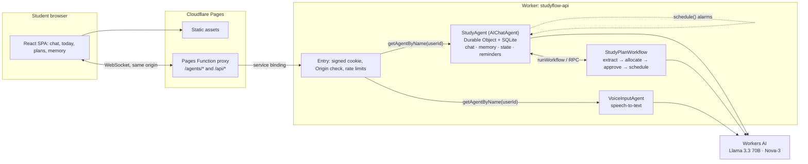

# Studyflow

Studyflow is an AI study coach for students, built on Cloudflare. A student pastes a syllabus and an exam date. Studyflow turns that into a day-by-day study plan (which the student approves), reminds them when each session starts, tutors them in real-time chat, quizzes them, and remembers their goals and weak topics across sessions. Push-to-talk voice dictation is optional.

**Stack:** Llama 3.3 70B on Workers AI · Cloudflare Agents SDK (`AIChatAgent` on SQLite-backed Durable Objects) · Workflows · Agent scheduling (Durable Object alarms) · Workers · Pages (React + Vite) · Workers AI Deepgram Nova-3 for speech-to-text.

<!-- stage:start -->
**Latest captured stage:** Planning complete and published to the private GitHub repo Umang3172/studyflow (main). Next: milestone M0 (spikes + scaffold). Application implementation not started (transcripts captured up to 2026-10-08T10:54:37Z).
<!-- stage:end -->

## Architecture



| Document | Purpose |
| --- | --- |
| [PLAN.md](PLAN.md) | Full implementation plan: scope, assumptions, decisions, architecture, data model, flows, interfaces, runtime prompts, token budgets, security, dependencies, tests, deployment, milestones, risks |
| [HANDOFF.md](HANDOFF.md) | Short brief for the coding model: non-negotiables, chosen tools, coding guidance, next steps |
| [docs/dev-phases.json](docs/dev-phases.json) | Phase boundaries for the development token report |
| [scripts/sync_readme_log.py](scripts/sync_readme_log.py) | Regenerates the stage line, token table and conversation appendix |

## Status

Planning is complete. Application code has not been started; the next step is milestone M0 (spikes and scaffold) in PLAN.md §16. Run and deploy instructions will be added here as milestones land; the planned commands are in PLAN.md §15.

## Development token usage

These figures cover the AI models used to **build** Studyflow. They come from the `usage` field of each API response in the local Claude Code session transcripts, counted once per message. "Input (uncached)", "Cache write" and "Cache read" are separate input categories; output includes reasoning tokens. Anything the transcripts do not record is marked unavailable.

<!-- dev-usage:start -->
| Phase | Model | API calls | Input (uncached) | Cache write | Cache read | Output |
| --- | --- | ---: | ---: | ---: | ---: | ---: |
| Planning attempt 1: research (stopped by API safeguard) | `claude-opus-5-5` | 34 | 68 | 119,927 | 3,768,483 | 14,400 |
| Planning 2a: research (Cloudflare docs, repos, versions) | `claude-opus-5-5` | 47 | 94 | 154,026 | 6,200,521 | 41,260 |
| Planning 2b: authoring PLAN, HANDOFF, README, tooling | `claude-opus-5-5` | 23 | 46 | 75,347 | 5,796,759 | 56,679 |
| Planning 2c: verification, Git, GitHub publish | `claude-opus-5-5` | 5 | 10 | 2,368 | 1,377,125 | 1,967 |
| **Total** | `claude-opus-5-5` | **109** | **218** | **351,668** | **17,142,888** | **114,306** |
| All phases | WebFetch page-summarizer model | unavailable | unavailable | unavailable | unavailable | unavailable |
| All phases | Safety classifier passes | unavailable | unavailable | unavailable | unavailable | unavailable |
<!-- dev-usage:end -->

## Application runtime usage

These figures cover Studyflow's own Workers AI calls once it runs. They are tracked per student in the `llm_usage` table (PLAN.md §6, §19) and kept separate from development usage.

| Feature | Model | Input tokens | Output tokens | Audio minutes | Neurons |
| --- | --- | --- | --- | --- | --- |
| Chat | `@cf/meta/llama-3.3-70b-instruct-fp8-fast` | unavailable (not built yet) | unavailable | — | unavailable |
| Plan topic extraction | `@cf/meta/llama-3.3-70b-instruct-fp8-fast` | unavailable (not built yet) | unavailable | — | unavailable |
| Voice dictation | `@cf/deepgram/nova-3` | — | — | unavailable (not built yet) | unavailable |

## Appendix

<details>
<summary><strong>Project conversation transcript</strong> (verbatim user and assistant messages, secrets redacted)</summary>

This appendix is generated by `scripts/sync_readme_log.py` from the local session transcripts. It contains human-typed user messages, harness notices and visible assistant replies, verbatim, with tokens, keys and email addresses redacted. Tool inputs and outputs are reduced to one-line markers, and model reasoning is not included. Messages sent after the capture time shown in the stage line are not included yet.

<!-- conversation:start -->
#### Session 1: `8f26e8e1` (2026-10-08T10:29:47Z → 2026-10-08T10:33:41Z)

**User** · 2026-10-08T10:29:47Z

```text
I want to build an AI assistant for students(lets name it Studyflow). Explore the idea yourself, choose a useful small MVP and create a detailed implementation plan.
Use the supplied Cloudflare documentation. Include Llama 3.3 on Workers AI, Workers, Workflows, the Agents SDK backed by Durable Objects, a Pages frontend, persistent memory, state, real-time chat and scheduled reminders. Consider voice if practical.
Evaluate these repositories during planning, use what fits and record the chosen tools and coding guidance in the handoff:

* https://github.com/mermaid-js/mermaid
* https://github.com/d2lang/d2
* https://github.com/DietrichGebert/ponytail
* https://developers.cloudflare.com/agents/

Create PLAN.md covering architecture, features, data flow, dependencies, runtime prompts, token budgets, security, tests and deployment. Create a short HANDOFF.md so the coding model can continue without rereading the full transcript.
Start README.md with the project overview, architecture diagram and a collapsible appendix containing the entire available user/assistant project conversation verbatim, with secrets redacted. Maintain it throughout planning and coding, noting the latest captured stage.
Include reported development token usage by model and phase: input, output and cached tokens where available. Keep application runtime usage separate. Mark missing figures as unavailable.
Initialize Git, add .gitignore, commit the planning documents and push to the configured remote. If none exists, create a private studyflow repository using my authenticated GitHub account. If access is unavailable, finish locally and report the blocker.
Make reasonable assumptions and document them. Stop before application implementation.
```

_[tool activity omitted: Bash ×7, ToolSearch ×1]_

**Assistant** · 2026-10-08T10:30:37Z

```text
I'll split the full docs into per-page files so I can read the relevant ones precisely.
```

_[tool activity omitted: Bash ×6]_

**Assistant** · 2026-10-08T10:31:07Z

```text
I'm still reading the Agents docs. Chat persistence and streaming are covered; next are scheduling, Workflows, voice and auth.
```

_[tool activity omitted: Bash ×3]_

**Assistant** · 2026-10-08T10:31:21Z

```text
Now the Agents + Workflows integration pages.
```

_[tool activity omitted: Bash ×6]_

**Assistant** · 2026-10-08T10:32:00Z

```text
Llama 3.3 is confirmed: 24k-token context, function calling, and $0.293 / $2.253 per million input/output tokens. Next I'm checking its JSON mode and the speech models.
```

_[tool activity omitted: Bash ×6]_

**Assistant** · 2026-10-08T10:33:05Z

```text
Package versions are pinned down: agents 0.27, ai-chat 0.12, AI SDK 7 and wrangler 4.148. Next I'm checking peer dependencies, then the three repos.
```

_[tool activity omitted: Bash ×1]_

**Harness notice** · 2026-10-08T10:33:10Z

```text
Your response above was stopped by a safety classifier — this is not a tool or API error. The rest of it was withheld, and tool calls in it that had not finished did not run. Do not produce that content again, even reworded.
```

**Assistant** · 2026-10-08T10:33:14Z

```text
Next I'm looking at the three candidate repositories (mermaid, d2, ponytail) through the GitHub API.
```

_[tool activity omitted: Bash ×4]_

**Assistant (system-generated)** · 2026-10-08T10:33:41Z

```text
API Error: Opus 5.5's safeguards flagged this message (https://www.anthropic.com/legal/aup). This sometimes happens with safe, normal conversations. Claude Code can't respond to this message with Opus 5.5.

Try rephrasing the request in a new session or change your model.

Learn more: https://support.claude.com/en/articles/8106465

Details: `[reasoning_extraction]`

Request ID: req_011CfpcsEDWX9rksxTUMib6W

Message ID: msg_011CfpcsEc5Gy1v8JEqes4Kc
```

#### Session 2: `1f8482aa` (2026-10-08T10:36:19Z → 2026-10-08T10:54:37Z)

**User** · 2026-10-08T10:36:19Z

```text
I want to build an AI assistant for students(lets name it Studyflow). Explore the idea yourself, choose a useful small MVP and create a detailed implementation plan.
Use the supplied Cloudflare documentation. Include Llama 3.3 on Workers AI, Workers, Workflows, the Agents SDK backed by Durable Objects, a Pages frontend, persistent memory, state, real-time chat and scheduled reminders. Consider voice if practical.
Evaluate these repositories during planning, use what fits and record the chosen tools and coding guidance in the handoff:

* https://github.com/mermaid-js/mermaid
* https://github.com/d2lang/d2
* https://github.com/DietrichGebert/ponytail
* https://developers.cloudflare.com/agents/

Create PLAN.md covering architecture, features, data flow, dependencies, runtime prompts, token budgets, security, tests and deployment. Create a short HANDOFF.md so the coding model can continue without rereading the full transcript.
Start README.md with the project overview, architecture diagram and a collapsible appendix containing the entire available user/assistant project conversation verbatim, with secrets redacted. Maintain it throughout planning and coding, noting the latest captured stage.
Include reported development token usage by model and phase: input, output and cached tokens where available. Keep application runtime usage separate. Mark missing figures as unavailable.
Initialize Git, add .gitignore, commit the planning documents and push to the configured remote. If none exists, create a private studyflow repository using my authenticated GitHub account. If access is unavailable, finish locally and report the blocker.
Make reasonable assumptions and document them. Stop before application implementation.
```

**Assistant** · 2026-10-08T10:36:21Z

```text
I'll start by looking at what's in the working directory, including the Cloudflare documentation you mentioned.
```

_[tool activity omitted: Bash ×3, ToolSearch ×1, WebFetch ×4]_

**Assistant** · 2026-10-08T10:37:00Z

```text
The Agents docs have a newer structure than I expected (channels / harness / runtime / tools). I'll pull the docs index and the key runtime pages.
```

_[tool activity omitted: Bash ×2]_

**Assistant** · 2026-10-08T10:37:12Z

```text
The index is comprehensive. I'll download the relevant pages as Markdown so I can read them in detail.
```

_[tool activity omitted: Bash ×2]_

**Assistant** · 2026-10-08T10:37:31Z

```text
Downloaded 42 pages (~940 KB). I'll read the most important ones first: the chat example, the Llama 3.3 model page, and the models integration.
```

_[tool activity omitted: Bash ×9]_

**Assistant** · 2026-10-08T10:38:41Z

```text
Voice is practical but beta. I'm leaning toward push-to-talk dictation that feeds the text chat, so there is a single conversation history. Now the scheduling and Workflows docs.
```

_[tool activity omitted: Bash ×4]_

**Assistant** · 2026-10-08T10:39:07Z

```text
Workflows fit well for a "syllabus → study plan" pipeline, with `waitForApproval` letting the student confirm before reminders are scheduled. Next: the rules of Workflows, then state/memory.
```

_[tool activity omitted: Bash ×6]_

**Assistant** · 2026-10-08T10:39:44Z

```text
Still in research: reading the AIChatAgent server API (message persistence, storage caps, server-initiated messages) before drafting the plan.
```

_[tool activity omitted: Bash ×5]_

**Assistant** · 2026-10-08T10:40:24Z

```text
Service bindings from Pages Functions are documented, but WebSocket pass-through isn't stated explicitly. I'll make it a Phase 0 spike with documented fallbacks. Now the routing auth hooks.
```

_[tool activity omitted: Bash ×5]_

**Assistant** · 2026-10-08T10:40:59Z

```text
The testing doc names `@cloudflare/vitest-plugin` with `vitest@^4.1.0`, but npm's latest vitest is 5.0.3. I'll check compatibility.
```

_[tool activity omitted: Bash ×2]_

**Assistant** · 2026-10-08T10:41:21Z

```text
`@cloudflare/vitest-pool-workers` is deprecated in favour of `@cloudflare/vitest-plugin@1.3.7` (needs `vitest@^4.1`, not 5). Next, a check on how `@callable()` decorators must be compiled.
```

_[tool activity omitted: Bash ×4, Read ×1]_

**Assistant** · 2026-10-08T10:42:26Z

```text
There's an earlier session in this project (`8f26e8e1`, 15:49–16:06) as well as this one. Both belong in the appendix. I'll inspect the transcript structure.
```

_[tool activity omitted: Bash ×3]_

**Assistant** · 2026-10-08T10:44:57Z

```text
Usage records repeat per content block, so I'll dedupe by message ID. Research is complete, so I'm recording the phase boundary for the token report and moving to authoring.
```

_[tool activity omitted: Bash ×1, mcp__ccd_session__mark_chapter ×1]_

**Assistant** · 2026-10-08T10:45:22Z

```text
`useAgentChat` also fetches initial messages over HTTP, so custom routing must cover that path too; I'll add it to the Phase 0 spike. A few remaining version checks before writing:
```

_[tool activity omitted: Bash ×1]_

**Assistant** · 2026-10-08T10:46:32Z

```text
Version checks done. One more look at user-record metadata (keys only, no content) so the export can tell real user messages from harness notices:
```

_[tool activity omitted: Bash ×1]_

**Assistant** · 2026-10-08T10:47:15Z

```text
Human messages carry `origin.kind == "human"` and harness notices carry `isMeta`, so the export can label them correctly. Now writing PLAN.md.
```

_[tool activity omitted: Write ×1]_

**Assistant** · 2026-10-08T10:50:43Z

```text
The plan mentions a per-hour session limit, but the Workers Rate Limiting binding may only support short windows. Checking:
```

_[tool activity omitted: Bash ×1]_

**Assistant** · 2026-10-08T10:50:47Z

```text
The period must be 10 or 60 seconds, so I'll make the plan consistent.
```

_[tool activity omitted: Edit ×8, Bash ×2, Write ×1]_

**Assistant** · 2026-10-08T10:52:10Z

```text
`\b` doesn't match between `_` and `SECRET`, so the pattern missed `SESSION_SECRET`. I'll widen it to whole identifiers containing the keyword.
```

_[tool activity omitted: Edit ×1, Bash ×1]_

**Assistant** · 2026-10-08T10:52:16Z

```text
Self-test passes. Now the phase boundaries file:
```

_[tool activity omitted: Write ×1]_

**Assistant** · 2026-10-08T10:52:26Z

```text
Now HANDOFF.md, kept short so a coding model can start without the transcript:
```

_[tool activity omitted: Write ×1]_

**Assistant** · 2026-10-08T10:52:55Z

```text
Now README.md with the marker blocks the script fills:
```

_[tool activity omitted: Write ×1]_

**Assistant** · 2026-10-08T10:53:13Z

```text
Now `.gitignore`:
```

_[tool activity omitted: Write ×1, Bash ×1]_

**Assistant** · 2026-10-08T10:53:21Z

```text
The script populated the table: 95 unique API calls, 342k cache-write, 13.3M cache-read and 109k output tokens across both sessions. Checking the appendix for formatting and leaked secrets:
```

_[tool activity omitted: Bash ×1]_

**Assistant** · 2026-10-08T10:53:31Z

```text
No leaks found. Before committing, I'll check that every Mermaid diagram actually parses by rendering them with mermaid@12.1.0 in the in-app browser.
```

_[tool activity omitted: Bash ×1, mcp__Claude_Browser__preview_start ×1, mcp__Claude_Browser__get_page_text ×1]_

**Assistant** · 2026-10-08T10:53:46Z

```text
Local files open as static snapshots without scripts, so I'll serve the check page over a temporary local HTTP server.
```

_[tool activity omitted: Bash ×1, mcp__Claude_Browser__browser_batch ×1]_

**Assistant** · 2026-10-08T10:53:58Z

```text
All 5 diagrams parse and render under mermaid@12.1.0 with `securityLevel: "strict"`. Cleaning up the temporary server and browser tabs:
```

_[tool activity omitted: ToolSearch ×1, mcp__Claude_Browser__tabs_close ×1, TaskStop ×1]_

**Assistant** · 2026-10-08T10:54:04Z

```text
Now the publish phase. I'll record its start time, then initialize Git.
```

_[tool activity omitted: Bash ×2, Edit ×1]_

**Assistant** · 2026-10-08T10:54:13Z

```text
No remote is configured and `Umang3172/studyflow` doesn't exist yet. I'll refresh the README stage, then stage and review the files before committing.
```

_[tool activity omitted: Bash ×2]_

**Assistant** · 2026-10-08T10:54:21Z

```text
Committed. Now creating the private `studyflow` repository on your authenticated account and pushing:
```

_[tool activity omitted: Bash ×1]_

**Assistant** · 2026-10-08T10:54:35Z

```text
Pushed to the private repo. Last step: refresh the README so its stage line and token table include the publish phase, then commit and push that.
```

_[tool activity omitted: Bash ×1]_

<!-- conversation:end -->

</details>
