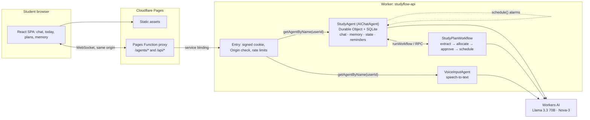

# Studyflow

Studyflow is an AI study coach for students, built on Cloudflare. A student pastes a syllabus and an exam date. Studyflow turns that into a day-by-day study plan (which the student approves), reminds them when each session starts, tutors them in real-time chat, quizzes them, and remembers their goals and weak topics across sessions. Push-to-talk voice dictation is optional.

**Stack:** Llama 3.3 70B on Workers AI · Cloudflare Agents SDK (`AIChatAgent` on SQLite-backed Durable Objects) · Workflows · Agent scheduling (Durable Object alarms) · Workers · Pages (React + Vite) · Workers AI Deepgram Nova-3 for speech-to-text.

<!-- stage:start -->
**Latest captured stage:** MVP built and verified locally with a mock model (93 tests, browser, Pages dev proxy); real Workers AI evals and deployment need the user's Cloudflare login. Not yet committed (transcripts captured up to 2026-10-08T11:43:41Z).
<!-- stage:end -->

## Architecture



| Document | Purpose |
| --- | --- |
| [PLAN.md](PLAN.md) | Full implementation plan: scope, assumptions, decisions, architecture, data model, flows, interfaces, runtime prompts, token budgets, security, dependencies, tests, deployment, milestones, risks |
| [HANDOFF.md](HANDOFF.md) | Short brief for the next coding session: state, deviations from the plan, gotchas, open items |
| [docs/spikes.md](docs/spikes.md) | Results of the M0 spikes S1-S5 and other findings from verifying the current APIs |
| [apps/api/evals/run.mjs](apps/api/evals/run.mjs) | Golden-prompt evals for the real model (writes `docs/evals.md` with `--write`) |
| [docs/dev-phases.json](docs/dev-phases.json) | Phase boundaries for the development token report |
| [scripts/sync_readme_log.py](scripts/sync_readme_log.py) | Regenerates the stage line, token table and conversation appendix |

## Status

The MVP is built: onboarding, streaming tutor chat, memory, reminders and daily check-ins, study-plan workflow with approval, live synced state, and push-to-talk dictation (feature-flagged). It runs and is tested **with a deterministic mock model**; it has **not** been run against real Workers AI or deployed, because that needs your Cloudflare login (PLAN A9).

| Area | Verified how | Not verified |
| --- | --- | --- |
| Worker routing, cookies, origin checks, per-student isolation, read-only state | 9 integration tests in workerd | Rate-limit bindings under real load |
| Chat streaming, tools, approvals, caps, memory, account deletion | 16 integration tests with the mock model (`agent` and `plan` suites) plus the app in a real browser | Llama 3.3 tool-call accuracy and quality (run `apps/api/evals/run.mjs`) |
| Rolling summary, context and token budgets | Unit tests (budgets asserted) and an integration test that folds 60 long turns | Estimator accuracy vs real token counts (`DIVISOR` in `budget.ts`) |
| Reminders and check-ins | Integration tests; a reminder fired for real in the browser (toast, chat message, no model call) | Closed-tab notifications (out of scope for the MVP) |
| Study plans (Workflow, allocator, approval, Mermaid chart) | Unit tests for the allocator and DST; workflow tests; end-to-end in the browser through the Pages dev proxy with the CSP on | `pause`/`resume`/`terminate` of workflows (they do not work under `wrangler dev`) |
| Voice dictation | Route, protocol handshake and cap check | Microphone capture and Nova-3 transcription in Chrome and Safari |
| Pages deployment | `wrangler pages dev` with a service binding; `wrangler deploy --dry-run` (3.5 MiB, 697 KiB gzip) | A deployed Pages project |
| Accessibility | Labels, roles, live regions, keyboard-operable controls | A formal audit (axe, screen reader) |

Skipped on purpose (see HANDOFF.md): Playwright E2E, GitHub Actions CI, Web Push, Llama Guard, passkeys, file upload.

## Quick start

**Prerequisites:** Node 22+ and npm 10 (developed on Node 22.23 and npm 10.9). Python 3 is only needed for `scripts/sync_readme_log.py`. A Cloudflare account and `npx wrangler login` are needed only for real Workers AI and for deploying.

```bash
npm ci   # .npmrc sets legacy-peer-deps=true: npm 10.9's resolver crashes on this dependency tree (docs/spikes.md)
```

### Run locally with the mock model (no Cloudflare login)

```bash
cp apps/api/.dev.vars.example apps/api/.dev.vars   # then set SESSION_SECRET to a long random string
npm run dev:mock -w apps/api                       # Worker on http://localhost:8787, MOCK_AI=1
npm run dev -w apps/web                            # SPA on http://localhost:5173 (proxies /agents and /api to :8787)
```

Open http://localhost:5173, complete onboarding and try the app. The mock coach gives canned replies and understands a few phrases so the tool paths run: `remind me 2026-10-09T10:00 to email my TA`, `remember that I like worked examples`, `what's coming up`, and `make me a plan for Operating Systems exam 2026-10-22` (after pasting a topic list, one topic per line).

### Run locally with real Llama 3.3

```bash
npx wrangler login
# in apps/api/.dev.vars delete the MOCK_AI line (or set MOCK_AI=0), keep SESSION_SECRET
npm run dev -w apps/api
npm run dev -w apps/web
node apps/api/evals/run.mjs --write   # optional: 11 golden prompts, records docs/evals.md
```

Workers AI always runs remotely, so every message spends neurons from your account (the free allocation is 10,000 per day, roughly 40 chat turns).

### Tests and checks

```bash
npm test          # 93 tests in workerd (68 unit, 25 integration); no login needed
npm run check     # oxlint, oxfmt --check, tsc for the API and the web app
```

### Preview the production wiring locally

```bash
npm run build -w apps/web
npm run dev:mock -w apps/api
cd apps/web && npx wrangler pages dev dist --port 8788 --service API=studyflow-api-mock   # open http://localhost:8788
```

### Deploy (you run these; they use your login and secrets)

```bash
npx wrangler login
npm run deploy -w apps/api                                                     # Worker studyflow-api
openssl rand -base64 32 | npx wrangler secret put SESSION_SECRET --config apps/api/wrangler.jsonc
npm run build -w apps/web
cd apps/web && npx wrangler pages deploy dist --project-name studyflow         # Pages + Function + service binding
```

Then set `ALLOWED_ORIGINS` in `apps/api/wrangler.jsonc` to your Pages origin (for example `https://studyflow.pages.dev`; preview deployments have other origins) and run `npm run deploy -w apps/api` again. Smoke test: the session cookie is set, the WebSocket connects (101 in DevTools), chat streams, a reminder two minutes ahead fires, and a plan can be approved. Workers Paid is recommended for any public use, and a Workers AI spend alert should be set in the dashboard. Rotating `SESSION_SECRET` signs everyone out and orphans their data.

### Configuration

| Name | Where | Default | Purpose |
| --- | --- | --- | --- |
| `SESSION_SECRET` | secret (`.dev.vars` locally) | none, required | Signs the anonymous session cookie |
| `ALLOWED_ORIGINS` | `wrangler.jsonc` vars | `http://localhost:5173` | Comma-separated origins allowed to open WebSockets and change state |
| `DAILY_CHAT_TURNS` / `DAILY_PLAN_STARTS` / `DAILY_VOICE_SECONDS` | vars | 40 / 3 / 300 | Per-student daily caps |
| `VOICE_ENABLED` | vars | `true` | Hides and rejects voice dictation when not `true` |
| `MOCK_AI` | `.dev.vars` only | unset | `1` swaps Workers AI for the mock model. Never set it in production. |

## How it keeps tokens low

| Technique | Where | Numbers |
| --- | --- | --- |
| **Compact prompts** | `lib/prompts.ts` | Tutor system prompt about 350 tokens (budget 900). It is static, so Workers AI can prefix-cache it. Six tool schemas fit in 800 tokens; tool results are capped at 400 characters. |
| **Relevant context only** | `lib/context.ts`, `lib/memory.ts` | A per-turn block built from SQL: local time, courses, active plan, next 5 reminders and at most 15 memories (goal, weak topic, preference, strength, fact; boosted by overlap with the current message), within 1,200 tokens. Rows are dropped, never the header. |
| **Rolling summary** | `lib/history.ts` | The model sees the summary of older turns plus the newest turns. When verbatim history passes 8,000 tokens, the oldest turns are folded into the summary in one short call, leaving about 4,000 verbatim, so the extra call happens once per roughly 4,000 tokens of new conversation. If the summariser fails, a deterministic extractive summary is used. Clearing the chat clears the summary. |
| **Validated tool calls** | `lib/tools.ts`, `shared/schemas.ts` | zod validates every tool input before it runs (real date-times, enums, length caps, id format); the server then checks the data (ids exist, time is in the future and within 180 days, caps, 2 memories per turn). Failures return `{ok:false,error}` so the model can correct itself within 4 steps. Cancelling a reminder and starting a plan need the student's approval. Old tool calls are pruned from context. |
| **No model where code will do** | planner, reminders, check-ins | The study schedule is a deterministic allocator (one LLM call per plan, to read the syllabus). Reminders and the daily check-in are templates: no model call. The plan tool reads a pasted syllabus from the chat history instead of making the model copy up to 12,000 characters into a tool call. |
| **Hard limits** | `lib/budget.ts` | `maxOutputTokens` 1,024 on every call; estimated input never exceeds 20,000 of the 24,000-token window (oldest turns are dropped first); daily caps per student. |

Under the mock model the first turn of a new student estimates about 500 tokens for system prompt, context and message (measured by the same 3.5 characters-per-token estimator, not a real tokenizer), plus about 750 for tool schemas.

## Project layout

```text
apps/api/    Worker "studyflow-api": entry handler, StudyAgent, VoiceInputAgent, StudyPlanWorkflow, lib/*, tests, evals
apps/web/    Vite + React SPA, Pages Function proxy (functions/), _headers (CSP), wrangler.jsonc for Pages
packages/shared/   zod schemas, state types, limits, Gantt source (source-only TypeScript, no build step)
docs/        spikes.md, dev-phases.json (and evals.md once you run the evals)
scripts/     sync_readme_log.py
```

## Development token usage

These figures cover the AI models used to **build** Studyflow. They come from the `usage` field of each API response in the local Claude Code session transcripts, counted once per message. "Input (uncached)", "Cache write" and "Cache read" are separate input categories; output includes reasoning tokens. Anything the transcripts do not record is marked unavailable.

<!-- dev-usage:start -->
| Phase | Model | API calls | Input (uncached) | Cache write | Cache read | Output |
| --- | --- | ---: | ---: | ---: | ---: | ---: |
| Planning attempt 1: research (stopped by API safeguard) | `claude-opus-5-5` | 34 | 68 | 119,927 | 3,768,483 | 14,400 |
| Planning 2a: research (Cloudflare docs, repos, versions) | `claude-opus-5-5` | 47 | 94 | 154,026 | 6,200,521 | 41,260 |
| Planning 2b: authoring PLAN, HANDOFF, README, tooling | `claude-opus-5-5` | 23 | 46 | 75,347 | 5,796,759 | 56,679 |
| Planning 2c: verification, Git, GitHub publish | `claude-opus-5-5` | 6 | 12 | 3,504 | 1,654,011 | 3,932 |
| Build 1: verify APIs, scaffold, dependencies | `claude-sonnet-5-5` | 35 | 70 | 151,084 | 4,715,267 | 32,010 |
| Build 2: API implementation (libs, agents, workflow, entry) | `claude-sonnet-5-5` | 33 | 66 | 99,085 | 8,064,126 | 72,525 |
| Build 3: unit and integration tests | `claude-sonnet-5-5` | 37 | 74 | 84,089 | 12,275,044 | 51,381 |
| Build 4: web app (React, Pages Function) | `claude-sonnet-5-5` | 9 | 18 | 35,185 | 3,551,018 | 26,443 |
| Build 5: browser verification, fixes, lint | `claude-sonnet-5-5` | 63 | 126 | 85,402 | 28,231,373 | 46,325 |
| Build 6: evals, documentation, README | `claude-sonnet-5-5` | 27 | 54 | 48,961 | 14,176,789 | 29,787 |
| **Total** | `claude-opus-5-5` | **110** | **220** | **352,804** | **17,419,774** | **116,271** |
| **Total** | `claude-sonnet-5-5` | **204** | **408** | **503,806** | **71,013,617** | **258,471** |
| All phases | WebFetch page-summarizer model | unavailable | unavailable | unavailable | unavailable | unavailable |
| All phases | Safety classifier passes | unavailable | unavailable | unavailable | unavailable | unavailable |
<!-- dev-usage:end -->

## Application runtime usage

These figures cover Studyflow's own Workers AI calls once it runs against the real model. Each call writes one row (feature, model, input and output tokens, audio seconds, estimated neurons; never message content) to the student's `llm_usage` table, which is visible to that student under Settings → AI usage and as live counters in the header and Today panel. This is separate from development usage above.

No real Workers AI call has been made yet (no Cloudflare login was available), so the measured figures are **unavailable**. The mock model also writes rows, but they are not real usage and are not reported here. Estimates from PLAN.md §10 (3.5 characters per token, published prices) are shown for planning only.

| Feature | Model | Input tokens | Output tokens | Audio minutes | Neurons |
| --- | --- | --- | --- | --- | --- |
| Chat turn | `@cf/meta/llama-3.3-70b-instruct-fp8-fast` | unavailable (estimate about 6,000 typical) | unavailable (estimate about 400) | n/a | unavailable (estimate about 242) |
| Rolling summary | `@cf/meta/llama-3.3-70b-instruct-fp8-fast` | unavailable | unavailable (cap 300) | n/a | unavailable |
| Plan topic extraction | `@cf/meta/llama-3.3-70b-instruct-fp8-fast` | unavailable (estimate up to 5,000) | unavailable (cap 1,500) | n/a | unavailable (estimate about 379) |
| Voice dictation | `@cf/deepgram/nova-3` | n/a | n/a | unavailable | unavailable (estimate about 836 per minute) |

After you run it with a real account, replace the table with the totals from Settings → AI usage (or `SELECT feature, sum(input_tokens), sum(output_tokens), sum(neurons_est) FROM llm_usage GROUP BY feature`).

## Appendix

<details>
<summary><strong>Project conversation transcript</strong> (verbatim user and assistant messages, secrets redacted)</summary>

This appendix is generated by `scripts/sync_readme_log.py` from the local session transcripts. It contains human-typed user messages, harness notices and visible assistant replies, verbatim, with tokens, keys and email addresses redacted. Tool inputs and outputs are reduced to one-line markers, and model reasoning is not included. Messages sent after the capture time shown in the stage line are not included yet.

<!-- conversation:start -->
#### Session 1: `8f26e8e1` (2026-10-08T10:29:47Z → 2026-10-08T10:33:41Z)

**User** · 2026-10-08T10:29:47Z

```text
I want to build an AI assistant for students(lets name it Studyflow). Explore the idea yourself, choose a useful small MVP and create a detailed implementation plan.
Use the supplied Cloudflare documentation. Include Llama 3.3 on Workers AI, Workers, Workflows, the Agents SDK backed by Durable Objects, a Pages frontend, persistent memory, state, real-time chat and scheduled reminders. Consider voice if practical.
Evaluate these repositories during planning, use what fits and record the chosen tools and coding guidance in the handoff:

* https://github.com/mermaid-js/mermaid
* https://github.com/d2lang/d2
* https://github.com/DietrichGebert/ponytail
* https://developers.cloudflare.com/agents/

Create PLAN.md covering architecture, features, data flow, dependencies, runtime prompts, token budgets, security, tests and deployment. Create a short HANDOFF.md so the coding model can continue without rereading the full transcript.
Start README.md with the project overview, architecture diagram and a collapsible appendix containing the entire available user/assistant project conversation verbatim, with secrets redacted. Maintain it throughout planning and coding, noting the latest captured stage.
Include reported development token usage by model and phase: input, output and cached tokens where available. Keep application runtime usage separate. Mark missing figures as unavailable.
Initialize Git, add .gitignore, commit the planning documents and push to the configured remote. If none exists, create a private studyflow repository using my authenticated GitHub account. If access is unavailable, finish locally and report the blocker.
Make reasonable assumptions and document them. Stop before application implementation.
```

_[tool activity omitted: Bash ×7, ToolSearch ×1]_

**Assistant** · 2026-10-08T10:30:37Z

```text
I'll split the full docs into per-page files so I can read the relevant ones precisely.
```

_[tool activity omitted: Bash ×6]_

**Assistant** · 2026-10-08T10:31:07Z

```text
I'm still reading the Agents docs. Chat persistence and streaming are covered; next are scheduling, Workflows, voice and auth.
```

_[tool activity omitted: Bash ×3]_

**Assistant** · 2026-10-08T10:31:21Z

```text
Now the Agents + Workflows integration pages.
```

_[tool activity omitted: Bash ×6]_

**Assistant** · 2026-10-08T10:32:00Z

```text
Llama 3.3 is confirmed: 24k-token context, function calling, and $0.293 / $2.253 per million input/output tokens. Next I'm checking its JSON mode and the speech models.
```

_[tool activity omitted: Bash ×6]_

**Assistant** · 2026-10-08T10:33:05Z

```text
Package versions are pinned down: agents 0.27, ai-chat 0.12, AI SDK 7 and wrangler 4.148. Next I'm checking peer dependencies, then the three repos.
```

_[tool activity omitted: Bash ×1]_

**Harness notice** · 2026-10-08T10:33:10Z

```text
Your response above was stopped by a safety classifier — this is not a tool or API error. The rest of it was withheld, and tool calls in it that had not finished did not run. Do not produce that content again, even reworded.
```

**Assistant** · 2026-10-08T10:33:14Z

```text
Next I'm looking at the three candidate repositories (mermaid, d2, ponytail) through the GitHub API.
```

_[tool activity omitted: Bash ×4]_

**Assistant (system-generated)** · 2026-10-08T10:33:41Z

```text
API Error: Opus 5.5's safeguards flagged this message (https://www.anthropic.com/legal/aup). This sometimes happens with safe, normal conversations. Claude Code can't respond to this message with Opus 5.5.

Try rephrasing the request in a new session or change your model.

Learn more: https://support.claude.com/en/articles/8106465

Details: `[reasoning_extraction]`

Request ID: req_011CfpcsEDWX9rksxTUMib6W

Message ID: msg_011CfpcsEc5Gy1v8JEqes4Kc
```

#### Session 2: `1f8482aa` (2026-10-08T10:36:19Z → 2026-10-08T10:55:01Z)

**User** · 2026-10-08T10:36:19Z

```text
I want to build an AI assistant for students(lets name it Studyflow). Explore the idea yourself, choose a useful small MVP and create a detailed implementation plan.
Use the supplied Cloudflare documentation. Include Llama 3.3 on Workers AI, Workers, Workflows, the Agents SDK backed by Durable Objects, a Pages frontend, persistent memory, state, real-time chat and scheduled reminders. Consider voice if practical.
Evaluate these repositories during planning, use what fits and record the chosen tools and coding guidance in the handoff:

* https://github.com/mermaid-js/mermaid
* https://github.com/d2lang/d2
* https://github.com/DietrichGebert/ponytail
* https://developers.cloudflare.com/agents/

Create PLAN.md covering architecture, features, data flow, dependencies, runtime prompts, token budgets, security, tests and deployment. Create a short HANDOFF.md so the coding model can continue without rereading the full transcript.
Start README.md with the project overview, architecture diagram and a collapsible appendix containing the entire available user/assistant project conversation verbatim, with secrets redacted. Maintain it throughout planning and coding, noting the latest captured stage.
Include reported development token usage by model and phase: input, output and cached tokens where available. Keep application runtime usage separate. Mark missing figures as unavailable.
Initialize Git, add .gitignore, commit the planning documents and push to the configured remote. If none exists, create a private studyflow repository using my authenticated GitHub account. If access is unavailable, finish locally and report the blocker.
Make reasonable assumptions and document them. Stop before application implementation.
```

**Assistant** · 2026-10-08T10:36:21Z

```text
I'll start by looking at what's in the working directory, including the Cloudflare documentation you mentioned.
```

_[tool activity omitted: Bash ×3, ToolSearch ×1, WebFetch ×4]_

**Assistant** · 2026-10-08T10:37:00Z

```text
The Agents docs have a newer structure than I expected (channels / harness / runtime / tools). I'll pull the docs index and the key runtime pages.
```

_[tool activity omitted: Bash ×2]_

**Assistant** · 2026-10-08T10:37:12Z

```text
The index is comprehensive. I'll download the relevant pages as Markdown so I can read them in detail.
```

_[tool activity omitted: Bash ×2]_

**Assistant** · 2026-10-08T10:37:31Z

```text
Downloaded 42 pages (~940 KB). I'll read the most important ones first: the chat example, the Llama 3.3 model page, and the models integration.
```

_[tool activity omitted: Bash ×9]_

**Assistant** · 2026-10-08T10:38:41Z

```text
Voice is practical but beta. I'm leaning toward push-to-talk dictation that feeds the text chat, so there is a single conversation history. Now the scheduling and Workflows docs.
```

_[tool activity omitted: Bash ×4]_

**Assistant** · 2026-10-08T10:39:07Z

```text
Workflows fit well for a "syllabus → study plan" pipeline, with `waitForApproval` letting the student confirm before reminders are scheduled. Next: the rules of Workflows, then state/memory.
```

_[tool activity omitted: Bash ×6]_

**Assistant** · 2026-10-08T10:39:44Z

```text
Still in research: reading the AIChatAgent server API (message persistence, storage caps, server-initiated messages) before drafting the plan.
```

_[tool activity omitted: Bash ×5]_

**Assistant** · 2026-10-08T10:40:24Z

```text
Service bindings from Pages Functions are documented, but WebSocket pass-through isn't stated explicitly. I'll make it a Phase 0 spike with documented fallbacks. Now the routing auth hooks.
```

_[tool activity omitted: Bash ×5]_

**Assistant** · 2026-10-08T10:40:59Z

```text
The testing doc names `@cloudflare/vitest-plugin` with `vitest@^4.1.0`, but npm's latest vitest is 5.0.3. I'll check compatibility.
```

_[tool activity omitted: Bash ×2]_

**Assistant** · 2026-10-08T10:41:21Z

```text
`@cloudflare/vitest-pool-workers` is deprecated in favour of `@cloudflare/vitest-plugin@1.3.7` (needs `vitest@^4.1`, not 5). Next, a check on how `@callable()` decorators must be compiled.
```

_[tool activity omitted: Bash ×4, Read ×1]_

**Assistant** · 2026-10-08T10:42:26Z

```text
There's an earlier session in this project (`8f26e8e1`, 15:49–16:06) as well as this one. Both belong in the appendix. I'll inspect the transcript structure.
```

_[tool activity omitted: Bash ×3]_

**Assistant** · 2026-10-08T10:44:57Z

```text
Usage records repeat per content block, so I'll dedupe by message ID. Research is complete, so I'm recording the phase boundary for the token report and moving to authoring.
```

_[tool activity omitted: Bash ×1, mcp__ccd_session__mark_chapter ×1]_

**Assistant** · 2026-10-08T10:45:22Z

```text
`useAgentChat` also fetches initial messages over HTTP, so custom routing must cover that path too; I'll add it to the Phase 0 spike. A few remaining version checks before writing:
```

_[tool activity omitted: Bash ×1]_

**Assistant** · 2026-10-08T10:46:32Z

```text
Version checks done. One more look at user-record metadata (keys only, no content) so the export can tell real user messages from harness notices:
```

_[tool activity omitted: Bash ×1]_

**Assistant** · 2026-10-08T10:47:15Z

```text
Human messages carry `origin.kind == "human"` and harness notices carry `isMeta`, so the export can label them correctly. Now writing PLAN.md.
```

_[tool activity omitted: Write ×1]_

**Assistant** · 2026-10-08T10:50:43Z

```text
The plan mentions a per-hour session limit, but the Workers Rate Limiting binding may only support short windows. Checking:
```

_[tool activity omitted: Bash ×1]_

**Assistant** · 2026-10-08T10:50:47Z

```text
The period must be 10 or 60 seconds, so I'll make the plan consistent.
```

_[tool activity omitted: Edit ×8, Bash ×2, Write ×1]_

**Assistant** · 2026-10-08T10:52:10Z

```text
`\b` doesn't match between `_` and `SECRET`, so the pattern missed `SESSION_SECRET`. I'll widen it to whole identifiers containing the keyword.
```

_[tool activity omitted: Edit ×1, Bash ×1]_

**Assistant** · 2026-10-08T10:52:16Z

```text
Self-test passes. Now the phase boundaries file:
```

_[tool activity omitted: Write ×1]_

**Assistant** · 2026-10-08T10:52:26Z

```text
Now HANDOFF.md, kept short so a coding model can start without the transcript:
```

_[tool activity omitted: Write ×1]_

**Assistant** · 2026-10-08T10:52:55Z

```text
Now README.md with the marker blocks the script fills:
```

_[tool activity omitted: Write ×1]_

**Assistant** · 2026-10-08T10:53:13Z

```text
Now `.gitignore`:
```

_[tool activity omitted: Write ×1, Bash ×1]_

**Assistant** · 2026-10-08T10:53:21Z

```text
The script populated the table: 95 unique API calls, 342k cache-write, 13.3M cache-read and 109k output tokens across both sessions. Checking the appendix for formatting and leaked secrets:
```

_[tool activity omitted: Bash ×1]_

**Assistant** · 2026-10-08T10:53:31Z

```text
No leaks found. Before committing, I'll check that every Mermaid diagram actually parses by rendering them with mermaid@12.1.0 in the in-app browser.
```

_[tool activity omitted: Bash ×1, mcp__Claude_Browser__preview_start ×1, mcp__Claude_Browser__get_page_text ×1]_

**Assistant** · 2026-10-08T10:53:46Z

```text
Local files open as static snapshots without scripts, so I'll serve the check page over a temporary local HTTP server.
```

_[tool activity omitted: Bash ×1, mcp__Claude_Browser__browser_batch ×1]_

**Assistant** · 2026-10-08T10:53:58Z

```text
All 5 diagrams parse and render under mermaid@12.1.0 with `securityLevel: "strict"`. Cleaning up the temporary server and browser tabs:
```

_[tool activity omitted: ToolSearch ×1, mcp__Claude_Browser__tabs_close ×1, TaskStop ×1]_

**Assistant** · 2026-10-08T10:54:04Z

```text
Now the publish phase. I'll record its start time, then initialize Git.
```

_[tool activity omitted: Bash ×2, Edit ×1]_

**Assistant** · 2026-10-08T10:54:13Z

```text
No remote is configured and `Umang3172/studyflow` doesn't exist yet. I'll refresh the README stage, then stage and review the files before committing.
```

_[tool activity omitted: Bash ×2]_

**Assistant** · 2026-10-08T10:54:21Z

```text
Committed. Now creating the private `studyflow` repository on your authenticated account and pushing:
```

_[tool activity omitted: Bash ×1]_

**Assistant** · 2026-10-08T10:54:35Z

```text
Pushed to the private repo. Last step: refresh the README so its stage line and token table include the publish phase, then commit and push that.
```

_[tool activity omitted: Bash ×1]_

**Assistant** · 2026-10-08T10:54:59Z

```text
The plan is done and pushed. It's in your new private repo, [Umang3172/studyflow](https://github.com/Umang3172/studyflow), as two commits on `main`. No application code was written and nothing was deployed to Cloudflare.

**What's in the repo**
- [PLAN.md](PLAN.md): the full plan, covering everything you listed (architecture, features, data flow, dependencies, prompts, token budgets, security, tests, deployment) plus milestones, risks and my assumptions.
- [HANDOFF.md](HANDOFF.md): the short brief for the coding model, with the rules it must follow, the chosen tools and the coding guidance.
- [README.md](README.md): the overview, architecture diagram, development token usage, a separate (still empty) section for the app's own AI usage, and the collapsible appendix with the conversation, secrets redacted.
- [scripts/sync_readme_log.py](scripts/sync_readme_log.py): rebuilds the README's stage line, token table and appendix from the session logs, so the coding model can keep the README current.

**The MVP I chose: an "exam sprint coach"**
- Real-time tutor chat on Llama 3.3 that gives hints before answers and runs 5-question quizzes.
- Memory of the student's goals and weak topics, which the student can see and delete.
- A study plan built from a pasted syllabus by a Workflow. The student approves the plan before any reminders are set.
- Scheduled session reminders and a daily check-in.
- Optional push-to-talk voice input.

**Findings that shaped the plan**
- **Pages:** Cloudflare now recommends Workers over Pages for new projects. I kept Pages as you asked. A small Pages Function forwards chat and API traffic to the Worker so everything stays on one domain. WebSockets passing through that route isn't documented, so it's the first thing to test (spike S1), with fallbacks written up.
- **Llama 3.3:** it only holds 24,000 tokens of context, and by default stops after 256 tokens of output. The plan sets explicit budgets and output limits for every call.
- **Two security gaps in the defaults:**
  - Cloudflare's default agent addressing would let anyone open another student's agent. The server picks the agent from a signed cookie instead.
  - Clients can write agent state by default. All client writes are rejected; changes go through validated methods.
- **Voice is expensive:** Workers AI's free tier is 10,000 "neurons" a day per account, and one minute of speech-to-text uses about 836 of them. So voice is capped dictation only, and read-aloud uses the browser's free speech feature. A public launch needs the paid Workers plan, since the free tier covers only about 40 chat turns a day in total.

**Repositories**

| Repository | Decision | Why |
| --- | --- | --- |
| Cloudflare Agents docs | Main reference | Every platform decision is checked against it |
| Mermaid | Adopted | All diagrams in the docs, plus the plan timeline in the app. All 5 diagrams render without errors |
| D2 | Rejected | GitHub doesn't render it, and its package is about 96 MB, far over Worker size limits |
| Ponytail | Principles only, in HANDOFF.md | I didn't install the plugin: it runs hooks, and v5.0.0 was published only hours before planning |

**Development token usage** (Opus 5.5, 109 API calls across 4 phases): 218 uncached input, 351,668 cache-write, 17,142,888 cache-read and 114,306 output tokens. The page-summarizer model and safety checks don't report usage, so they're marked unavailable.

**Things to know**
- An earlier planning session in this folder was cut off by an API safeguard error. It's in the appendix and token table as its own phase.
- The appendix covers the conversation up to 10:54 UTC, so it doesn't include this reply. The next session refreshes it by running the script.
- Some questions are open in PLAN.md §20, each with a default I've assumed:
  - Keep Pages if the WebSocket test fails? (assumed yes)
  - Is an anonymous, device-only identity acceptable for the first release? (assumed yes)
  - Custom domain? (assumed `studyflow.pages.dev`)
  - Install Ponytail for coding sessions? (assumed no)
```

#### Session 3: `50df2b13` (2026-10-08T10:55:30Z → 2026-10-08T11:43:41Z)

**User** · 2026-10-08T10:55:30Z

```text
Read PLAN.md and HANDOFF.md and build the MVP. Verify current APIs, keep the implementation simple and use compact prompts, relevant context, rolling summaries and validated tool calls. Update setup instructions, conversation history and reported token usage as you work.
```

**Assistant** · 2026-10-08T10:55:32Z

```text
I'll start by reading the plan and handoff docs.
```

_[tool activity omitted: Bash ×11, Read ×5]_

**Assistant** · 2026-10-08T10:57:37Z

```text
Quick status: scaffolding is done and I'm installing dependencies. npm's resolver crashed on a peer-dependency bug around vitest, so I'm retrying with a workaround.
```

_[tool activity omitted: Bash ×17]_

**Assistant** · 2026-10-08T11:00:15Z

```text
Typings confirm what I need. Before designing the reminder code I'm reading the scheduling doc for callback signatures and gotchas.
```

_[tool activity omitted: Bash ×5]_

**Assistant** · 2026-10-08T11:01:01Z

```text
Context is now sufficient to start writing code. First the shared package (limits, zod schemas, state types).
```

_[tool activity omitted: Bash ×1]_

**Assistant** · 2026-10-08T11:01:17Z

```text
Shared package is written. Now the API's pure helpers, starting with timezone handling (`time.ts`), the riskiest piece for reminders.
```

_[tool activity omitted: Write ×2, Bash ×1]_

**Assistant** · 2026-10-08T11:02:05Z

```text
Now auth (signed cookie), the token estimator/budget, prompts and the message templates.
```

_[tool activity omitted: Write ×11, Bash ×8]_

**Assistant** · 2026-10-08T11:06:01Z

```text
Now the core piece: the study-plan workflow's helper (topic extraction with validation and one repair attempt), then the agent itself.
```

_[tool activity omitted: Write ×1, Bash ×1]_

**Assistant** · 2026-10-08T11:06:20Z

```text
Now the main `StudyAgent`.
```

_[tool activity omitted: Write ×1, Bash ×2]_

**Assistant** · 2026-10-08T11:07:54Z

```text
Now the Worker entry handler (cookie session, origin checks, rate limits, per-user agent routing, account deletion).
```

_[tool activity omitted: Write ×1, Bash ×6]_

**Assistant** · 2026-10-08T11:08:48Z

```text
Status: all app source for the API is drafted (agent, workflow, entry, libs). Now writing configs and the voice agent, then I'll typecheck and start running tests.
```

_[tool activity omitted: Bash ×5]_

**Assistant** · 2026-10-08T11:09:38Z

```text
Typecheck is clean. Now the unit tests for the pure modules (time/DST, planner edge cases, auth, budget/context/history, prompts, tools).
```

_[tool activity omitted: Bash ×7]_

**Assistant** · 2026-10-08T11:11:44Z

```text
The `ai` binding is always remote, so the test pool wants Cloudflare credentials. I'll add a mock config without the `ai` binding for tests and offline dev.
```

_[tool activity omitted: Bash ×2]_

**Assistant** · 2026-10-08T11:12:35Z

```text
Unit suites pass in workerd. Adding unit tests for budget/context/history (rolling summary), prompts/parsers and tool schemas.
```

_[tool activity omitted: Bash ×5, Write ×1]_

**Assistant** · 2026-10-08T11:14:17Z

```text
Status: 63 unit tests pass. Now integration tests against the real Worker and Durable Objects in workerd. Checking the test helpers the plugin exposes first.
```

_[tool activity omitted: Bash ×11]_

**Assistant** · 2026-10-08T11:17:38Z

```text
Streaming, tool validation, memory, cap and past-time rejection already work end to end. The four failures are my test helper (chunks are JSON strings) and the default 5 s timeout; fixing both.
```

_[tool activity omitted: Bash ×4]_

**Assistant** · 2026-10-08T11:19:29Z

```text
All 18 integration tests pass (the `destroyed` log line is workerd noting the intentional `destroy()` abort). Now the plan workflow test, which is spike S5: Workflows under the vitest plugin.
```

_[tool activity omitted: Bash ×2]_

**Assistant** · 2026-10-08T11:20:09Z

```text
85/85 tests pass and the typecheck is clean. Next I'll check that the Worker actually bundles and runs under `wrangler dev` (esbuild + decorators), using the mock config.
```

_[tool activity omitted: Bash ×1]_

**Assistant** · 2026-10-08T11:20:31Z

```text
The Worker bundles and runs under `wrangler dev` without any login. Leaving it running for the browser check. Now the web app; first the hook signatures from the installed typings.
```

_[tool activity omitted: Bash ×6]_

**Assistant** · 2026-10-08T11:21:41Z

```text
Now the shared client helpers, styles and entry points.
```

_[tool activity omitted: Bash ×3]_

**Assistant** · 2026-10-08T11:22:52Z

```text
Now the Today, Memory, Settings and Plan panels.
```

_[tool activity omitted: Bash ×3]_

**Assistant** · 2026-10-08T11:24:15Z

```text
Build succeeds, but the main chunk is 1 MB (320 KB gzip). Checking what's inflating it before moving on.
```

_[tool activity omitted: Bash ×2, mcp__Claude_Browser__preview_start ×2, mcp__Claude_Browser__computer ×1]_

**Assistant** · 2026-10-08T11:24:52Z

```text
The full path works in a real browser: SPA → Vite proxy → Worker → per-student Durable Object → synced state → onboarding screen. Filling the form and trying the app.
```

_[tool activity omitted: mcp__Claude_Browser__read_page ×1, mcp__Claude_Browser__browser_batch ×1]_

**Assistant** · 2026-10-08T11:25:00Z

```text
Blank screen after submitting, which means a runtime crash. Checking the console.
```

_[tool activity omitted: mcp__Claude_Browser__read_console_messages ×2, Bash ×6, mcp__Claude_Browser__navigate ×2, mcp__Claude_Browser__computer ×2, mcp__Claude_Browser__find ×1]_

**Assistant** · 2026-10-08T11:26:02Z

```text
State and session persist across reloads. Now sending chat messages, including one that triggers a reminder tool call.
```

_[tool activity omitted: mcp__Claude_Browser__browser_batch ×1]_

**Assistant** · 2026-10-08T11:26:12Z

```text
Chat streams and the live usage counters update (508 in / 35 out tokens). Next the reminder tool path plus a real firing a minute out, so I need the current local time.
```

_[tool activity omitted: Bash ×2, mcp__Claude_Browser__browser_batch ×1, Write ×1]_

**Assistant** · 2026-10-08T11:26:44Z

```text
S3 resolved: `Temporal` is **not** available in this workerd, and `Intl` handles it. Now checking whether the reminder fired in the browser.
```

_[tool activity omitted: mcp__Claude_Browser__computer ×10, Bash ×6, mcp__Claude_Browser__find ×1, mcp__Claude_Browser__read_page ×1, mcp__Claude_Browser__browser_batch ×1]_

**Assistant** · 2026-10-08T11:30:01Z

```text
The test caught a real bug: Devanagari (and other scripts) use combining marks (category `M`), which my label filter stripped. Allowing `\p{M}`; it carries no Mermaid syntax risk.
```

_[tool activity omitted: Bash ×1, mcp__Claude_Browser__navigate ×1, mcp__Claude_Browser__find ×1, mcp__Claude_Browser__browser_batch ×1, mcp__Claude_Browser__computer ×3]_

**Assistant** · 2026-10-08T11:30:38Z

```text
Much clearer. Two readability fixes remain: the x-axis labels crowd each other and the chart is wider than the panel. I'll add an adaptive tick interval and tighter chart sizing.
```

_[tool activity omitted: Bash ×1, mcp__Claude_Browser__navigate ×1, mcp__Claude_Browser__computer ×3]_

**Assistant** · 2026-10-08T11:30:56Z

```text
Readable now. Approving the plan to verify the activation step schedules the session reminders.
```

_[tool activity omitted: mcp__Claude_Browser__computer ×3]_

**Assistant** · 2026-10-08T11:31:07Z

```text
The plan is active with 27 sessions. Now testing account deletion and the re-onboarding path (this is where the earlier Suspense crash happened).
```

_[tool activity omitted: mcp__Claude_Browser__javascript_tool ×1, mcp__Claude_Browser__navigate ×1, mcp__Claude_Browser__computer ×3, mcp__Claude_Browser__read_console_messages ×1]_

**Assistant** · 2026-10-08T11:31:18Z

```text
Deletion → fresh session → onboarding works. Re-submitting the form to confirm the earlier blank-screen crash is gone.
```

_[tool activity omitted: mcp__Claude_Browser__read_page ×1, mcp__Claude_Browser__browser_batch ×2, mcp__Claude_Browser__read_console_messages ×4, Bash ×2, mcp__Claude_Browser__preview_stop ×1, mcp__Claude_Browser__preview_start ×1, mcp__Claude_Browser__navigate ×1, mcp__Claude_Browser__computer ×2, mcp__Claude_Browser__find ×1]_

**Assistant** · 2026-10-08T11:32:31Z

```text
Chat streams through Pages (S1 passes locally). Now the plan flow under the CSP to see whether Mermaid is blocked.
```

_[tool activity omitted: mcp__Claude_Browser__computer ×1, mcp__Claude_Browser__read_page ×1, mcp__Claude_Browser__browser_batch ×1, mcp__Claude_Browser__read_console_messages ×1, Bash ×2, mcp__Claude_Browser__javascript_tool ×1]_

**Assistant** · 2026-10-08T11:33:24Z

```text
Now confirming the browser client still works with identity disabled (chat history fetch, state sync).
```

_[tool activity omitted: mcp__Claude_Browser__navigate ×1, mcp__Claude_Browser__computer ×2]_

**Assistant** · 2026-10-08T11:33:33Z

```text
Works with identity disabled (history and state load). Quick mobile-width check of the layout.
```

_[tool activity omitted: mcp__Claude_Browser__resize_window ×2, mcp__Claude_Browser__navigate ×1, mcp__Claude_Browser__computer ×2, Bash ×7]_

**Assistant** · 2026-10-08T11:35:47Z

```text
Lint is clean. Applying the formatter across the repo, then re-running everything to be sure formatting changed nothing semantically.
```

_[tool activity omitted: Bash ×1]_

**Assistant** · 2026-10-08T11:36:25Z

```text
All green: lint, format, typecheck, and 93 tests. Next, verify the production bundle builds with the real (non-mock) config via a deploy dry-run (needs no login).
```

_[tool activity omitted: Bash ×1, Write ×1]_

**Assistant** · 2026-10-08T11:37:05Z

```text
Validating the runner's mechanics against the mock server (pass/fail here is meaningless since the mock isn't an LLM; I only want to confirm the script runs end to end).
```

_[tool activity omitted: Bash ×4]_

**Assistant** · 2026-10-08T11:38:13Z

```text
The dev-usage table is populated from this session's real transcript (now including `claude-sonnet-5-5` per build phase). Now the spike results document.
```

_[tool activity omitted: Write ×1]_

**Assistant** · 2026-10-08T11:38:30Z

```text
Now the README: setup instructions, how the token-saving design works, current status. I'll edit only the hand-written parts and leave the generated blocks alone.
```

_[tool activity omitted: Read ×1, Bash ×3]_

**Assistant** · 2026-10-08T11:40:00Z

```text
Now HANDOFF.md, rewritten for the next session: state, what was deviated from the plan and why, gotchas, and what's left.
```

_[tool activity omitted: Write ×1, Bash ×1]_

**Assistant** · 2026-10-08T11:40:44Z

```text
Formatting once more, then a clean-room reproducibility check: stop the dev servers, delete `node_modules`, `npm ci` from the lockfile, and run the full check + tests.
```

_[tool activity omitted: mcp__Claude_Browser__preview_stop ×2, Bash ×1]_

**Assistant** · 2026-10-08T11:41:19Z

```text
The zsh glob error aborted the delete, so that run used the existing `node_modules`. Redoing the clean install properly.
```

_[tool activity omitted: Bash ×1]_

**Assistant** · 2026-10-08T11:42:03Z

```text
Clean install, lint, format, typecheck and all 93 tests pass from the lockfile. Checking what would be committed, to be sure no secrets or build output are included.
```

_[tool activity omitted: Bash ×1, mcp__Claude_Browser__preview_start ×2, mcp__Claude_Browser__computer ×5, mcp__Claude_Browser__find ×1]_

**Assistant** · 2026-10-08T11:42:41Z

```text
Discarding works in the UI. Now the chat approval card: paste a multi-line syllabus (Shift+Enter for newlines), then ask for a plan.
```

_[tool activity omitted: mcp__Claude_Browser__browser_batch ×1]_

**Assistant** · 2026-10-08T11:42:54Z

```text
The approval card appears and nothing has started yet. Approving it.
```

_[tool activity omitted: mcp__Claude_Browser__computer ×3]_

**Assistant** · 2026-10-08T11:43:05Z

```text
The whole chat-driven plan path works in the UI: approval card → "✓ Study plan" → review screen built from the pasted syllabus. Now Settings (usage table, voice toggle).
```

_[tool activity omitted: mcp__Claude_Browser__find ×3, mcp__Claude_Browser__computer ×6, mcp__Claude_Browser__read_page ×1, mcp__Claude_Browser__javascript_tool ×1, mcp__Claude_Browser__preview_stop ×2, Bash ×1]_

<!-- conversation:end -->

</details>
