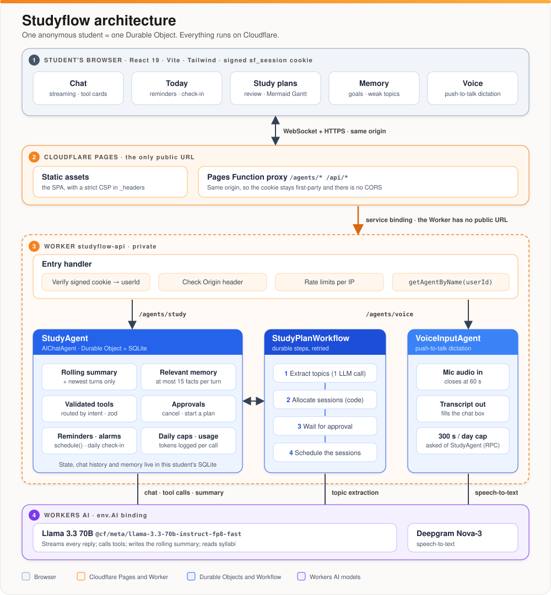

# Studyflow

## The prompt

The project started from this brief, given verbatim:

```text
I want to build an AI assistant for students(lets name it Studyflow). Explore the idea yourself, choose a useful small MVP and create a detailed implementation plan.
Use the supplied Cloudflare documentation. Include Llama 3.3 on Workers AI, Workers, Workflows, the Agents SDK backed by Durable Objects, a Pages frontend, persistent memory, state, real-time chat and scheduled reminders. Consider voice if practical.
Evaluate these repositories during planning, use what fits and record the chosen tools and coding guidance in the handoff:

* https://github.com/mermaid-js/mermaid
* https://github.com/d2lang/d2
* https://github.com/DietrichGebert/ponytail
* https://developers.cloudflare.com/agents/

Create PLAN.md covering architecture, features, data flow, dependencies, runtime prompts, token budgets, security, tests and deployment. Create a short HANDOFF.md so the coding model can continue without rereading the full transcript.
Start README.md with the project overview, architecture diagram and a collapsible appendix containing the entire available user/assistant project conversation verbatim, with secrets redacted. Maintain it throughout planning and coding, noting the latest captured stage.
Include reported development token usage by model and phase: input, output and cached tokens where available. Keep application runtime usage separate. Mark missing figures as unavailable.
Initialize Git, add .gitignore, commit the planning documents and push to the configured remote. If none exists, create a private studyflow repository using my authenticated GitHub account. If access is unavailable, finish locally and report the blocker.
Make reasonable assumptions and document them. Stop before application implementation.
```

The build step followed with:

```text
Read PLAN.md and HANDOFF.md and build the MVP. Verify current APIs, keep the implementation simple and use compact prompts, relevant context, rolling summaries and validated tool calls. Update setup instructions, conversation history and reported token usage as you work.
```

## Overview

Studyflow is an AI study coach for students, built on Cloudflare. A student pastes a syllabus and an exam date. Studyflow turns that into a day-by-day study plan (which the student approves), reminds them when each session starts, tutors them in real-time chat, quizzes them, and remembers their goals and weak topics across sessions. Push-to-talk voice dictation is optional.

**Stack:** Llama 3.3 70B on Workers AI · Cloudflare Agents SDK (`AIChatAgent` on SQLite-backed Durable Objects) · Workflows · Agent scheduling (Durable Object alarms) · Workers · Pages (React + Vite) · Workers AI Deepgram Nova-3 for speech-to-text.

<!-- stage:start -->
**Latest captured stage:** MVP deployed at https://studyflow-1ir.pages.dev and verified on real Workers AI (12/12 evals, 10/10 smoke); Playwright E2E, axe audit, CI, privacy notice; session race fixed (transcripts captured up to 2026-10-08T15:42:23Z).
<!-- stage:end -->

## Architecture



How a request travels:

1. The browser opens a WebSocket and HTTPS calls to its own origin (Pages). A signed `sf_session` cookie identifies the anonymous student.
2. The Pages Function forwards `/agents/*` and `/api/*` over a service binding. The Worker has no public URL.
3. The Worker checks the cookie, the `Origin` header and rate limits, then reaches that student's Durable Object with `getAgentByName(userId)`.
4. `StudyAgent` keeps chat, memory, state and reminders in its own SQLite, calls Llama 3.3, and starts `StudyPlanWorkflow` when a plan is requested. The plan waits for the student's approval before it schedules anything.
5. Reminders and the daily check-in are Durable Object alarms (`schedule()`); they use no model call.

| Document | Purpose |
| --- | --- |
| [PLAN.md](PLAN.md) | Full implementation plan: scope, assumptions, decisions, architecture, data model, flows, interfaces, runtime prompts, token budgets, security, dependencies, tests, deployment, milestones, risks |
| [HANDOFF.md](HANDOFF.md) | Short brief for the next coding session: state, deviations from the plan, gotchas, open items |
| [docs/spikes.md](docs/spikes.md) | Results of the M0 spikes S1-S5 and other findings from verifying the current APIs |
| [docs/a11y.md](docs/a11y.md) | Accessibility audit: method, findings, fixes, what still needs a human |
| [docs/privacy.md](docs/privacy.md) | What is stored, where it goes, deletion, and decisions to make before launching to college students |
| [apps/api/evals/run.mjs](apps/api/evals/run.mjs) | Golden-prompt evals for the real model, against the deployed app or a dev server (writes `docs/evals.md` with `--write`) |
| [.github/workflows/ci.yml](.github/workflows/ci.yml) | CI: lint, types, tests and build; Playwright E2E and axe accessibility checks |
| [docs/dev-phases.json](docs/dev-phases.json) | Phase boundaries for the development token report |
| [scripts/sync_readme_log.py](scripts/sync_readme_log.py) | Regenerates the stage line, token table and conversation appendix |

## Quick start

**Prerequisites:** Node 22+ and npm 10 (developed on Node 22.23 and npm 10.9). Python 3 is only needed for `scripts/sync_readme_log.py`. A Cloudflare account and `npx wrangler login` are needed only to deploy and for real Workers AI.

```bash
npm ci   # .npmrc sets legacy-peer-deps=true: npm 10.9's resolver crashes on this dependency tree (docs/spikes.md)
```

### Run locally with the mock model (no Cloudflare login)

```bash
cp apps/api/.dev.vars.example apps/api/.dev.vars   # then set SESSION_SECRET to a long random string
npm run dev:mock -w apps/api                       # Worker on http://localhost:8787, MOCK_AI=1
npm run dev -w apps/web                            # SPA on http://localhost:5173 (proxies /agents and /api to :8787)
```

Open http://localhost:5173, complete onboarding and try the app. The mock coach gives canned replies and understands a few phrases so the tool paths run: `remind me 2026-10-09T10:00 to email my TA`, `remember that I like worked examples`, `what's coming up`, and `make me a plan for Operating Systems exam 2026-10-22` (after pasting a topic list, one topic per line).

### Try the real model

Local `wrangler dev` with the real `ai` binding needs a **workers.dev subdomain registered on the account** (open the Workers page in the dashboard once). Without one, use the deployed app:

```bash
node apps/api/evals/run.mjs https://studyflow-1ir.pages.dev --write   # 12 golden prompts -> docs/evals.md (about 1,000 neurons)
node apps/api/evals/smoke.mjs https://studyflow-1ir.pages.dev         # end-to-end checks, about 3 minutes
```

Both create throwaway anonymous students and delete them afterwards. With a subdomain registered you can run `npm run dev -w apps/api` (real Workers AI, set `ALLOWED_ORIGINS=http://localhost:5173` in `.dev.vars`, drop `MOCK_AI`) and point the scripts at `http://localhost:8787`.

### Tests and checks

```bash
npm test          # 132 tests in workerd (100 unit, 32 integration); no login needed
npm run check     # oxlint, oxfmt --check, tsc for the API (after wrangler types) and the web app
PW_CHANNEL=chrome npm run e2e   # 19 Playwright tests (E2E + axe); uses your installed Chrome. CI uses Playwright's Chromium
```

CI (`.github/workflows/ci.yml`) runs all three on every push and pull request.

### Preview the production wiring locally

```bash
npm run build -w apps/web
npm run dev:mock -w apps/api
cd apps/web && npx wrangler pages dev dist --port 8788 --service API=studyflow-api-mock   # open http://localhost:8788
```

### Deploy

```bash
npx wrangler login
npm run deploy -w apps/api                                                      # Worker studyflow-api (private)
openssl rand -base64 32 | npx wrangler secret put SESSION_SECRET --config apps/api/wrangler.jsonc
cd apps/web && npx wrangler pages project create studyflow --production-branch main   # once; the name must be unique
npm run build -w apps/web && cd apps/web && npx wrangler pages deploy dist --project-name studyflow --branch main
```

The first Worker deploy needs a workers.dev subdomain on the account (a one-time dashboard visit). Pages may give the project a suffixed name (`studyflow-1ir.pages.dev` here because `studyflow` was taken): put the exact origin in `ALLOWED_ORIGINS` in `apps/api/wrangler.jsonc` and redeploy the Worker. Rotating `SESSION_SECRET` signs everyone out and orphans their data. Then run the smoke test above.

### Configuration

| Name | Where | Value | Purpose |
| --- | --- | --- | --- |
| `SESSION_SECRET` | secret (`.dev.vars` locally) | random | Signs the anonymous session cookie |
| `ALLOWED_ORIGINS` | `wrangler.jsonc` vars (production), `.dev.vars` (local) | `https://studyflow-1ir.pages.dev` in production | Comma-separated origins allowed to open WebSockets and change state |
| `DAILY_CHAT_TURNS` / `DAILY_PLAN_STARTS` / `DAILY_VOICE_SECONDS` | vars | 40 / 3 / 300 | Per-student daily caps |
| `VOICE_ENABLED` | vars | `true` | Hides and rejects voice dictation when not `true` |
| `MOCK_AI` | `.dev.vars` only | unset | `1` swaps Workers AI for the mock model. Never set it in production. |

## Project layout

```text
apps/api/    Worker "studyflow-api": entry handler, StudyAgent, VoiceInputAgent, StudyPlanWorkflow, lib/*, tests, evals (run.mjs, smoke.mjs)
apps/web/    Vite + React SPA, Pages Function proxy (functions/), _headers (CSP), Playwright E2E and axe tests (e2e/)
packages/shared/   zod schemas, state types, limits, Gantt source, leaked-tool-call stripper (source-only TypeScript, no build step)
docs/        spikes.md, evals.md, a11y.md, privacy.md, dev-phases.json
.github/     CI workflow
scripts/     sync_readme_log.py
```

## Development token usage

These figures cover the AI models used to **build** Studyflow. They come from the `usage` field of each API response in the local Claude Code session transcripts, counted once per message. "Input (uncached)", "Cache write" and "Cache read" are separate input categories; output includes reasoning tokens. Anything the transcripts do not record is marked unavailable.

<!-- dev-usage:start -->
| Phase | Model | API calls | Input (uncached) | Cache write | Cache read | Output |
| --- | --- | ---: | ---: | ---: | ---: | ---: |
| Planning attempt 1: research (stopped by API safeguard) | `claude-opus-5-5` | 34 | 68 | 119,927 | 3,768,483 | 14,400 |
| Planning 2a: research (Cloudflare docs, repos, versions) | `claude-opus-5-5` | 47 | 94 | 154,026 | 6,200,521 | 41,260 |
| Planning 2b: authoring PLAN, HANDOFF, README, tooling | `claude-opus-5-5` | 23 | 46 | 75,347 | 5,796,759 | 56,679 |
| Planning 2c: verification, Git, GitHub publish | `claude-opus-5-5` | 6 | 12 | 3,504 | 1,654,011 | 3,932 |
| Build 1: verify APIs, scaffold, dependencies | `claude-sonnet-5-5` | 35 | 70 | 151,084 | 4,715,267 | 32,010 |
| Build 2: API implementation (libs, agents, workflow, entry) | `claude-sonnet-5-5` | 33 | 66 | 99,085 | 8,064,126 | 72,525 |
| Build 3: unit and integration tests | `claude-sonnet-5-5` | 37 | 74 | 84,089 | 12,275,044 | 51,381 |
| Build 4: web app (React, Pages Function) | `claude-sonnet-5-5` | 9 | 18 | 35,185 | 3,551,018 | 26,443 |
| Build 5: browser verification, fixes, lint | `claude-sonnet-5-5` | 63 | 126 | 85,402 | 28,231,373 | 46,325 |
| Build 6: evals, documentation, README | `claude-sonnet-5-5` | 29 | 58 | 50,913 | 15,270,120 | 33,394 |
| Build 7: commit and push, Playwright E2E | `claude-sonnet-5-5` | 23 | 46 | 45,629 | 13,172,032 | 33,798 |
| Build 8: accessibility audit, CI, privacy notice | `claude-sonnet-5-5` | 25 | 50 | 48,814 | 15,544,284 | 28,658 |
| Build 9: deploy, real-model evals and debugging (duplicate-delta fix, guards, tool routing, calibration) | `claude-sonnet-5-5` | 50 | 100 | 106,340 | 34,725,458 | 73,175 |
| Build 10: final documentation and verification | `claude-sonnet-5-5` | 75 | 150 | 939,958 | 38,986,231 | 88,851 |
| **Total** | `claude-opus-5-5` | **110** | **220** | **352,804** | **17,419,774** | **116,271** |
| **Total** | `claude-sonnet-5-5` | **379** | **758** | **1,646,499** | **174,534,953** | **486,560** |
| All phases | WebFetch page-summarizer model | unavailable | unavailable | unavailable | unavailable | unavailable |
| All phases | Safety classifier passes | unavailable | unavailable | unavailable | unavailable | unavailable |
<!-- dev-usage:end -->

## Application runtime usage

Studyflow's own Workers AI calls, separate from development usage above. Each call writes one row (feature, model, input and output tokens, audio seconds, estimated neurons; never message content) to the student's `llm_usage` table, shown to that student under Settings → AI usage.

Measured on the deployed app by `apps/api/evals/run.mjs` (12 golden prompts, 2026-10-08, final build; real token counts from Workers AI, neurons estimated from the published per-token rates; also in [docs/evals.md](docs/evals.md)):

| Feature | Model | Calls | Input tokens | Output tokens | Audio minutes | Neurons |
| --- | --- | ---: | ---: | ---: | --- | ---: |
| Chat | `@cf/meta/llama-3.3-70b-instruct-fp8-fast` | 12 | 17,892 | 852 | n/a | 652 |
| Plan topic extraction | `@cf/meta/llama-3.3-70b-instruct-fp8-fast` | 1 | 190 | 72 | n/a | 20 |
| Rolling summary | `@cf/meta/llama-3.3-70b-instruct-fp8-fast` | 1 (separate check) | 586 | 41 | n/a | about 24 |
| Voice dictation | `@cf/deepgram/nova-3` | unavailable | n/a | n/a | unavailable (you tested it on a device; those rows are in your own Settings) | unavailable |

## Appendix

<details>
<summary><strong>Project conversation transcript</strong> (verbatim user and assistant messages, secrets redacted)</summary>

This appendix is generated by `scripts/sync_readme_log.py` from the local session transcripts. It contains human-typed user messages, harness notices and visible assistant replies, verbatim, with tokens, keys and email addresses redacted. Tool inputs and outputs are reduced to one-line markers, and model reasoning is not included. Messages sent after the capture time shown in the stage line are not included yet.

<!-- conversation:start -->
#### Session 1: `8f26e8e1` (2026-10-08T10:29:47Z → 2026-10-08T10:33:41Z)

**User** · 2026-10-08T10:29:47Z

```text
I want to build an AI assistant for students(lets name it Studyflow). Explore the idea yourself, choose a useful small MVP and create a detailed implementation plan.
Use the supplied Cloudflare documentation. Include Llama 3.3 on Workers AI, Workers, Workflows, the Agents SDK backed by Durable Objects, a Pages frontend, persistent memory, state, real-time chat and scheduled reminders. Consider voice if practical.
Evaluate these repositories during planning, use what fits and record the chosen tools and coding guidance in the handoff:

* https://github.com/mermaid-js/mermaid
* https://github.com/d2lang/d2
* https://github.com/DietrichGebert/ponytail
* https://developers.cloudflare.com/agents/

Create PLAN.md covering architecture, features, data flow, dependencies, runtime prompts, token budgets, security, tests and deployment. Create a short HANDOFF.md so the coding model can continue without rereading the full transcript.
Start README.md with the project overview, architecture diagram and a collapsible appendix containing the entire available user/assistant project conversation verbatim, with secrets redacted. Maintain it throughout planning and coding, noting the latest captured stage.
Include reported development token usage by model and phase: input, output and cached tokens where available. Keep application runtime usage separate. Mark missing figures as unavailable.
Initialize Git, add .gitignore, commit the planning documents and push to the configured remote. If none exists, create a private studyflow repository using my authenticated GitHub account. If access is unavailable, finish locally and report the blocker.
Make reasonable assumptions and document them. Stop before application implementation.
```

_[tool activity omitted: Bash ×7, ToolSearch ×1]_

**Assistant** · 2026-10-08T10:30:37Z

```text
I'll split the full docs into per-page files so I can read the relevant ones precisely.
```

_[tool activity omitted: Bash ×6]_

**Assistant** · 2026-10-08T10:31:07Z

```text
I'm still reading the Agents docs. Chat persistence and streaming are covered; next are scheduling, Workflows, voice and auth.
```

_[tool activity omitted: Bash ×3]_

**Assistant** · 2026-10-08T10:31:21Z

```text
Now the Agents + Workflows integration pages.
```

_[tool activity omitted: Bash ×6]_

**Assistant** · 2026-10-08T10:32:00Z

```text
Llama 3.3 is confirmed: 24k-token context, function calling, and $0.293 / $2.253 per million input/output tokens. Next I'm checking its JSON mode and the speech models.
```

_[tool activity omitted: Bash ×6]_

**Assistant** · 2026-10-08T10:33:05Z

```text
Package versions are pinned down: agents 0.27, ai-chat 0.12, AI SDK 7 and wrangler 4.148. Next I'm checking peer dependencies, then the three repos.
```

_[tool activity omitted: Bash ×1]_

**Harness notice** · 2026-10-08T10:33:10Z

```text
Your response above was stopped by a safety classifier — this is not a tool or API error. The rest of it was withheld, and tool calls in it that had not finished did not run. Do not produce that content again, even reworded.
```

**Assistant** · 2026-10-08T10:33:14Z

```text
Next I'm looking at the three candidate repositories (mermaid, d2, ponytail) through the GitHub API.
```

_[tool activity omitted: Bash ×4]_

**Assistant (system-generated)** · 2026-10-08T10:33:41Z

```text
API Error: Opus 5.5's safeguards flagged this message (https://www.anthropic.com/legal/aup). This sometimes happens with safe, normal conversations. Claude Code can't respond to this message with Opus 5.5.

Try rephrasing the request in a new session or change your model.

Learn more: https://support.claude.com/en/articles/8106465

Details: `[reasoning_extraction]`

Request ID: req_011CfpcsEDWX9rksxTUMib6W

Message ID: msg_011CfpcsEc5Gy1v8JEqes4Kc
```

#### Session 2: `1f8482aa` (2026-10-08T10:36:19Z → 2026-10-08T10:55:01Z)

**User** · 2026-10-08T10:36:19Z

```text
I want to build an AI assistant for students(lets name it Studyflow). Explore the idea yourself, choose a useful small MVP and create a detailed implementation plan.
Use the supplied Cloudflare documentation. Include Llama 3.3 on Workers AI, Workers, Workflows, the Agents SDK backed by Durable Objects, a Pages frontend, persistent memory, state, real-time chat and scheduled reminders. Consider voice if practical.
Evaluate these repositories during planning, use what fits and record the chosen tools and coding guidance in the handoff:

* https://github.com/mermaid-js/mermaid
* https://github.com/d2lang/d2
* https://github.com/DietrichGebert/ponytail
* https://developers.cloudflare.com/agents/

Create PLAN.md covering architecture, features, data flow, dependencies, runtime prompts, token budgets, security, tests and deployment. Create a short HANDOFF.md so the coding model can continue without rereading the full transcript.
Start README.md with the project overview, architecture diagram and a collapsible appendix containing the entire available user/assistant project conversation verbatim, with secrets redacted. Maintain it throughout planning and coding, noting the latest captured stage.
Include reported development token usage by model and phase: input, output and cached tokens where available. Keep application runtime usage separate. Mark missing figures as unavailable.
Initialize Git, add .gitignore, commit the planning documents and push to the configured remote. If none exists, create a private studyflow repository using my authenticated GitHub account. If access is unavailable, finish locally and report the blocker.
Make reasonable assumptions and document them. Stop before application implementation.
```

**Assistant** · 2026-10-08T10:36:21Z

```text
I'll start by looking at what's in the working directory, including the Cloudflare documentation you mentioned.
```

_[tool activity omitted: Bash ×3, ToolSearch ×1, WebFetch ×4]_

**Assistant** · 2026-10-08T10:37:00Z

```text
The Agents docs have a newer structure than I expected (channels / harness / runtime / tools). I'll pull the docs index and the key runtime pages.
```

_[tool activity omitted: Bash ×2]_

**Assistant** · 2026-10-08T10:37:12Z

```text
The index is comprehensive. I'll download the relevant pages as Markdown so I can read them in detail.
```

_[tool activity omitted: Bash ×2]_

**Assistant** · 2026-10-08T10:37:31Z

```text
Downloaded 42 pages (~940 KB). I'll read the most important ones first: the chat example, the Llama 3.3 model page, and the models integration.
```

_[tool activity omitted: Bash ×9]_

**Assistant** · 2026-10-08T10:38:41Z

```text
Voice is practical but beta. I'm leaning toward push-to-talk dictation that feeds the text chat, so there is a single conversation history. Now the scheduling and Workflows docs.
```

_[tool activity omitted: Bash ×4]_

**Assistant** · 2026-10-08T10:39:07Z

```text
Workflows fit well for a "syllabus → study plan" pipeline, with `waitForApproval` letting the student confirm before reminders are scheduled. Next: the rules of Workflows, then state/memory.
```

_[tool activity omitted: Bash ×6]_

**Assistant** · 2026-10-08T10:39:44Z

```text
Still in research: reading the AIChatAgent server API (message persistence, storage caps, server-initiated messages) before drafting the plan.
```

_[tool activity omitted: Bash ×5]_

**Assistant** · 2026-10-08T10:40:24Z

```text
Service bindings from Pages Functions are documented, but WebSocket pass-through isn't stated explicitly. I'll make it a Phase 0 spike with documented fallbacks. Now the routing auth hooks.
```

_[tool activity omitted: Bash ×5]_

**Assistant** · 2026-10-08T10:40:59Z

```text
The testing doc names `@cloudflare/vitest-plugin` with `vitest@^4.1.0`, but npm's latest vitest is 5.0.3. I'll check compatibility.
```

_[tool activity omitted: Bash ×2]_

**Assistant** · 2026-10-08T10:41:21Z

```text
`@cloudflare/vitest-pool-workers` is deprecated in favour of `@cloudflare/vitest-plugin@1.3.7` (needs `vitest@^4.1`, not 5). Next, a check on how `@callable()` decorators must be compiled.
```

_[tool activity omitted: Bash ×4, Read ×1]_

**Assistant** · 2026-10-08T10:42:26Z

```text
There's an earlier session in this project (`8f26e8e1`, 15:49–16:06) as well as this one. Both belong in the appendix. I'll inspect the transcript structure.
```

_[tool activity omitted: Bash ×3]_

**Assistant** · 2026-10-08T10:44:57Z

```text
Usage records repeat per content block, so I'll dedupe by message ID. Research is complete, so I'm recording the phase boundary for the token report and moving to authoring.
```

_[tool activity omitted: Bash ×1, mcp__ccd_session__mark_chapter ×1]_

**Assistant** · 2026-10-08T10:45:22Z

```text
`useAgentChat` also fetches initial messages over HTTP, so custom routing must cover that path too; I'll add it to the Phase 0 spike. A few remaining version checks before writing:
```

_[tool activity omitted: Bash ×1]_

**Assistant** · 2026-10-08T10:46:32Z

```text
Version checks done. One more look at user-record metadata (keys only, no content) so the export can tell real user messages from harness notices:
```

_[tool activity omitted: Bash ×1]_

**Assistant** · 2026-10-08T10:47:15Z

```text
Human messages carry `origin.kind == "human"` and harness notices carry `isMeta`, so the export can label them correctly. Now writing PLAN.md.
```

_[tool activity omitted: Write ×1]_

**Assistant** · 2026-10-08T10:50:43Z

```text
The plan mentions a per-hour session limit, but the Workers Rate Limiting binding may only support short windows. Checking:
```

_[tool activity omitted: Bash ×1]_

**Assistant** · 2026-10-08T10:50:47Z

```text
The period must be 10 or 60 seconds, so I'll make the plan consistent.
```

_[tool activity omitted: Edit ×8, Bash ×2, Write ×1]_

**Assistant** · 2026-10-08T10:52:10Z

```text
`\b` doesn't match between `_` and `SECRET`, so the pattern missed `SESSION_SECRET`. I'll widen it to whole identifiers containing the keyword.
```

_[tool activity omitted: Edit ×1, Bash ×1]_

**Assistant** · 2026-10-08T10:52:16Z

```text
Self-test passes. Now the phase boundaries file:
```

_[tool activity omitted: Write ×1]_

**Assistant** · 2026-10-08T10:52:26Z

```text
Now HANDOFF.md, kept short so a coding model can start without the transcript:
```

_[tool activity omitted: Write ×1]_

**Assistant** · 2026-10-08T10:52:55Z

```text
Now README.md with the marker blocks the script fills:
```

_[tool activity omitted: Write ×1]_

**Assistant** · 2026-10-08T10:53:13Z

```text
Now `.gitignore`:
```

_[tool activity omitted: Write ×1, Bash ×1]_

**Assistant** · 2026-10-08T10:53:21Z

```text
The script populated the table: 95 unique API calls, 342k cache-write, 13.3M cache-read and 109k output tokens across both sessions. Checking the appendix for formatting and leaked secrets:
```

_[tool activity omitted: Bash ×1]_

**Assistant** · 2026-10-08T10:53:31Z

```text
No leaks found. Before committing, I'll check that every Mermaid diagram actually parses by rendering them with mermaid@12.1.0 in the in-app browser.
```

_[tool activity omitted: Bash ×1, mcp__Claude_Browser__preview_start ×1, mcp__Claude_Browser__get_page_text ×1]_

**Assistant** · 2026-10-08T10:53:46Z

```text
Local files open as static snapshots without scripts, so I'll serve the check page over a temporary local HTTP server.
```

_[tool activity omitted: Bash ×1, mcp__Claude_Browser__browser_batch ×1]_

**Assistant** · 2026-10-08T10:53:58Z

```text
All 5 diagrams parse and render under mermaid@12.1.0 with `securityLevel: "strict"`. Cleaning up the temporary server and browser tabs:
```

_[tool activity omitted: ToolSearch ×1, mcp__Claude_Browser__tabs_close ×1, TaskStop ×1]_

**Assistant** · 2026-10-08T10:54:04Z

```text
Now the publish phase. I'll record its start time, then initialize Git.
```

_[tool activity omitted: Bash ×2, Edit ×1]_

**Assistant** · 2026-10-08T10:54:13Z

```text
No remote is configured and `Umang3172/studyflow` doesn't exist yet. I'll refresh the README stage, then stage and review the files before committing.
```

_[tool activity omitted: Bash ×2]_

**Assistant** · 2026-10-08T10:54:21Z

```text
Committed. Now creating the private `studyflow` repository on your authenticated account and pushing:
```

_[tool activity omitted: Bash ×1]_

**Assistant** · 2026-10-08T10:54:35Z

```text
Pushed to the private repo. Last step: refresh the README so its stage line and token table include the publish phase, then commit and push that.
```

_[tool activity omitted: Bash ×1]_

**Assistant** · 2026-10-08T10:54:59Z

```text
The plan is done and pushed. It's in your new private repo, [Umang3172/studyflow](https://github.com/Umang3172/studyflow), as two commits on `main`. No application code was written and nothing was deployed to Cloudflare.

**What's in the repo**
- [PLAN.md](PLAN.md): the full plan, covering everything you listed (architecture, features, data flow, dependencies, prompts, token budgets, security, tests, deployment) plus milestones, risks and my assumptions.
- [HANDOFF.md](HANDOFF.md): the short brief for the coding model, with the rules it must follow, the chosen tools and the coding guidance.
- [README.md](README.md): the overview, architecture diagram, development token usage, a separate (still empty) section for the app's own AI usage, and the collapsible appendix with the conversation, secrets redacted.
- [scripts/sync_readme_log.py](scripts/sync_readme_log.py): rebuilds the README's stage line, token table and appendix from the session logs, so the coding model can keep the README current.

**The MVP I chose: an "exam sprint coach"**
- Real-time tutor chat on Llama 3.3 that gives hints before answers and runs 5-question quizzes.
- Memory of the student's goals and weak topics, which the student can see and delete.
- A study plan built from a pasted syllabus by a Workflow. The student approves the plan before any reminders are set.
- Scheduled session reminders and a daily check-in.
- Optional push-to-talk voice input.

**Findings that shaped the plan**
- **Pages:** Cloudflare now recommends Workers over Pages for new projects. I kept Pages as you asked. A small Pages Function forwards chat and API traffic to the Worker so everything stays on one domain. WebSockets passing through that route isn't documented, so it's the first thing to test (spike S1), with fallbacks written up.
- **Llama 3.3:** it only holds 24,000 tokens of context, and by default stops after 256 tokens of output. The plan sets explicit budgets and output limits for every call.
- **Two security gaps in the defaults:**
  - Cloudflare's default agent addressing would let anyone open another student's agent. The server picks the agent from a signed cookie instead.
  - Clients can write agent state by default. All client writes are rejected; changes go through validated methods.
- **Voice is expensive:** Workers AI's free tier is 10,000 "neurons" a day per account, and one minute of speech-to-text uses about 836 of them. So voice is capped dictation only, and read-aloud uses the browser's free speech feature. A public launch needs the paid Workers plan, since the free tier covers only about 40 chat turns a day in total.

**Repositories**

| Repository | Decision | Why |
| --- | --- | --- |
| Cloudflare Agents docs | Main reference | Every platform decision is checked against it |
| Mermaid | Adopted | All diagrams in the docs, plus the plan timeline in the app. All 5 diagrams render without errors |
| D2 | Rejected | GitHub doesn't render it, and its package is about 96 MB, far over Worker size limits |
| Ponytail | Principles only, in HANDOFF.md | I didn't install the plugin: it runs hooks, and v5.0.0 was published only hours before planning |

**Development token usage** (Opus 5.5, 109 API calls across 4 phases): 218 uncached input, 351,668 cache-write, 17,142,888 cache-read and 114,306 output tokens. The page-summarizer model and safety checks don't report usage, so they're marked unavailable.

**Things to know**
- An earlier planning session in this folder was cut off by an API safeguard error. It's in the appendix and token table as its own phase.
- The appendix covers the conversation up to 10:54 UTC, so it doesn't include this reply. The next session refreshes it by running the script.
- Some questions are open in PLAN.md §20, each with a default I've assumed:
  - Keep Pages if the WebSocket test fails? (assumed yes)
  - Is an anonymous, device-only identity acceptable for the first release? (assumed yes)
  - Custom domain? (assumed `studyflow.pages.dev`)
  - Install Ponytail for coding sessions? (assumed no)
```

#### Session 3: `50df2b13` (2026-10-08T10:55:30Z → 2026-10-08T16:35:48Z)

**User** · 2026-10-08T10:55:30Z

```text
Read PLAN.md and HANDOFF.md and build the MVP. Verify current APIs, keep the implementation simple and use compact prompts, relevant context, rolling summaries and validated tool calls. Update setup instructions, conversation history and reported token usage as you work.
```

**Assistant** · 2026-10-08T10:55:32Z

```text
I'll start by reading the plan and handoff docs.
```

_[tool activity omitted: Bash ×11, Read ×5]_

**Assistant** · 2026-10-08T10:57:37Z

```text
Quick status: scaffolding is done and I'm installing dependencies. npm's resolver crashed on a peer-dependency bug around vitest, so I'm retrying with a workaround.
```

_[tool activity omitted: Bash ×17]_

**Assistant** · 2026-10-08T11:00:15Z

```text
Typings confirm what I need. Before designing the reminder code I'm reading the scheduling doc for callback signatures and gotchas.
```

_[tool activity omitted: Bash ×5]_

**Assistant** · 2026-10-08T11:01:01Z

```text
Context is now sufficient to start writing code. First the shared package (limits, zod schemas, state types).
```

_[tool activity omitted: Bash ×1]_

**Assistant** · 2026-10-08T11:01:17Z

```text
Shared package is written. Now the API's pure helpers, starting with timezone handling (`time.ts`), the riskiest piece for reminders.
```

_[tool activity omitted: Write ×2, Bash ×1]_

**Assistant** · 2026-10-08T11:02:05Z

```text
Now auth (signed cookie), the token estimator/budget, prompts and the message templates.
```

_[tool activity omitted: Write ×11, Bash ×8]_

**Assistant** · 2026-10-08T11:06:01Z

```text
Now the core piece: the study-plan workflow's helper (topic extraction with validation and one repair attempt), then the agent itself.
```

_[tool activity omitted: Write ×1, Bash ×1]_

**Assistant** · 2026-10-08T11:06:20Z

```text
Now the main `StudyAgent`.
```

_[tool activity omitted: Write ×1, Bash ×2]_

**Assistant** · 2026-10-08T11:07:54Z

```text
Now the Worker entry handler (cookie session, origin checks, rate limits, per-user agent routing, account deletion).
```

_[tool activity omitted: Write ×1, Bash ×6]_

**Assistant** · 2026-10-08T11:08:48Z

```text
Status: all app source for the API is drafted (agent, workflow, entry, libs). Now writing configs and the voice agent, then I'll typecheck and start running tests.
```

_[tool activity omitted: Bash ×5]_

**Assistant** · 2026-10-08T11:09:38Z

```text
Typecheck is clean. Now the unit tests for the pure modules (time/DST, planner edge cases, auth, budget/context/history, prompts, tools).
```

_[tool activity omitted: Bash ×7]_

**Assistant** · 2026-10-08T11:11:44Z

```text
The `ai` binding is always remote, so the test pool wants Cloudflare credentials. I'll add a mock config without the `ai` binding for tests and offline dev.
```

_[tool activity omitted: Bash ×2]_

**Assistant** · 2026-10-08T11:12:35Z

```text
Unit suites pass in workerd. Adding unit tests for budget/context/history (rolling summary), prompts/parsers and tool schemas.
```

_[tool activity omitted: Bash ×5, Write ×1]_

**Assistant** · 2026-10-08T11:14:17Z

```text
Status: 63 unit tests pass. Now integration tests against the real Worker and Durable Objects in workerd. Checking the test helpers the plugin exposes first.
```

_[tool activity omitted: Bash ×11]_

**Assistant** · 2026-10-08T11:17:38Z

```text
Streaming, tool validation, memory, cap and past-time rejection already work end to end. The four failures are my test helper (chunks are JSON strings) and the default 5 s timeout; fixing both.
```

_[tool activity omitted: Bash ×4]_

**Assistant** · 2026-10-08T11:19:29Z

```text
All 18 integration tests pass (the `destroyed` log line is workerd noting the intentional `destroy()` abort). Now the plan workflow test, which is spike S5: Workflows under the vitest plugin.
```

_[tool activity omitted: Bash ×2]_

**Assistant** · 2026-10-08T11:20:09Z

```text
85/85 tests pass and the typecheck is clean. Next I'll check that the Worker actually bundles and runs under `wrangler dev` (esbuild + decorators), using the mock config.
```

_[tool activity omitted: Bash ×1]_

**Assistant** · 2026-10-08T11:20:31Z

```text
The Worker bundles and runs under `wrangler dev` without any login. Leaving it running for the browser check. Now the web app; first the hook signatures from the installed typings.
```

_[tool activity omitted: Bash ×6]_

**Assistant** · 2026-10-08T11:21:41Z

```text
Now the shared client helpers, styles and entry points.
```

_[tool activity omitted: Bash ×3]_

**Assistant** · 2026-10-08T11:22:52Z

```text
Now the Today, Memory, Settings and Plan panels.
```

_[tool activity omitted: Bash ×3]_

**Assistant** · 2026-10-08T11:24:15Z

```text
Build succeeds, but the main chunk is 1 MB (320 KB gzip). Checking what's inflating it before moving on.
```

_[tool activity omitted: Bash ×2, mcp__Claude_Browser__preview_start ×2, mcp__Claude_Browser__computer ×1]_

**Assistant** · 2026-10-08T11:24:52Z

```text
The full path works in a real browser: SPA → Vite proxy → Worker → per-student Durable Object → synced state → onboarding screen. Filling the form and trying the app.
```

_[tool activity omitted: mcp__Claude_Browser__read_page ×1, mcp__Claude_Browser__browser_batch ×1]_

**Assistant** · 2026-10-08T11:25:00Z

```text
Blank screen after submitting, which means a runtime crash. Checking the console.
```

_[tool activity omitted: mcp__Claude_Browser__read_console_messages ×2, Bash ×6, mcp__Claude_Browser__navigate ×2, mcp__Claude_Browser__computer ×2, mcp__Claude_Browser__find ×1]_

**Assistant** · 2026-10-08T11:26:02Z

```text
State and session persist across reloads. Now sending chat messages, including one that triggers a reminder tool call.
```

_[tool activity omitted: mcp__Claude_Browser__browser_batch ×1]_

**Assistant** · 2026-10-08T11:26:12Z

```text
Chat streams and the live usage counters update (508 in / 35 out tokens). Next the reminder tool path plus a real firing a minute out, so I need the current local time.
```

_[tool activity omitted: Bash ×2, mcp__Claude_Browser__browser_batch ×1, Write ×1]_

**Assistant** · 2026-10-08T11:26:44Z

```text
S3 resolved: `Temporal` is **not** available in this workerd, and `Intl` handles it. Now checking whether the reminder fired in the browser.
```

_[tool activity omitted: mcp__Claude_Browser__computer ×10, Bash ×6, mcp__Claude_Browser__find ×1, mcp__Claude_Browser__read_page ×1, mcp__Claude_Browser__browser_batch ×1]_

**Assistant** · 2026-10-08T11:30:01Z

```text
The test caught a real bug: Devanagari (and other scripts) use combining marks (category `M`), which my label filter stripped. Allowing `\p{M}`; it carries no Mermaid syntax risk.
```

_[tool activity omitted: Bash ×1, mcp__Claude_Browser__navigate ×1, mcp__Claude_Browser__find ×1, mcp__Claude_Browser__browser_batch ×1, mcp__Claude_Browser__computer ×3]_

**Assistant** · 2026-10-08T11:30:38Z

```text
Much clearer. Two readability fixes remain: the x-axis labels crowd each other and the chart is wider than the panel. I'll add an adaptive tick interval and tighter chart sizing.
```

_[tool activity omitted: Bash ×1, mcp__Claude_Browser__navigate ×1, mcp__Claude_Browser__computer ×3]_

**Assistant** · 2026-10-08T11:30:56Z

```text
Readable now. Approving the plan to verify the activation step schedules the session reminders.
```

_[tool activity omitted: mcp__Claude_Browser__computer ×3]_

**Assistant** · 2026-10-08T11:31:07Z

```text
The plan is active with 27 sessions. Now testing account deletion and the re-onboarding path (this is where the earlier Suspense crash happened).
```

_[tool activity omitted: mcp__Claude_Browser__javascript_tool ×1, mcp__Claude_Browser__navigate ×1, mcp__Claude_Browser__computer ×3, mcp__Claude_Browser__read_console_messages ×1]_

**Assistant** · 2026-10-08T11:31:18Z

```text
Deletion → fresh session → onboarding works. Re-submitting the form to confirm the earlier blank-screen crash is gone.
```

_[tool activity omitted: mcp__Claude_Browser__read_page ×1, mcp__Claude_Browser__browser_batch ×2, mcp__Claude_Browser__read_console_messages ×4, Bash ×2, mcp__Claude_Browser__preview_stop ×1, mcp__Claude_Browser__preview_start ×1, mcp__Claude_Browser__navigate ×1, mcp__Claude_Browser__computer ×2, mcp__Claude_Browser__find ×1]_

**Assistant** · 2026-10-08T11:32:31Z

```text
Chat streams through Pages (S1 passes locally). Now the plan flow under the CSP to see whether Mermaid is blocked.
```

_[tool activity omitted: mcp__Claude_Browser__computer ×1, mcp__Claude_Browser__read_page ×1, mcp__Claude_Browser__browser_batch ×1, mcp__Claude_Browser__read_console_messages ×1, Bash ×2, mcp__Claude_Browser__javascript_tool ×1]_

**Assistant** · 2026-10-08T11:33:24Z

```text
Now confirming the browser client still works with identity disabled (chat history fetch, state sync).
```

_[tool activity omitted: mcp__Claude_Browser__navigate ×1, mcp__Claude_Browser__computer ×2]_

**Assistant** · 2026-10-08T11:33:33Z

```text
Works with identity disabled (history and state load). Quick mobile-width check of the layout.
```

_[tool activity omitted: mcp__Claude_Browser__resize_window ×2, mcp__Claude_Browser__navigate ×1, mcp__Claude_Browser__computer ×2, Bash ×7]_

**Assistant** · 2026-10-08T11:35:47Z

```text
Lint is clean. Applying the formatter across the repo, then re-running everything to be sure formatting changed nothing semantically.
```

_[tool activity omitted: Bash ×1]_

**Assistant** · 2026-10-08T11:36:25Z

```text
All green: lint, format, typecheck, and 93 tests. Next, verify the production bundle builds with the real (non-mock) config via a deploy dry-run (needs no login).
```

_[tool activity omitted: Bash ×1, Write ×1]_

**Assistant** · 2026-10-08T11:37:05Z

```text
Validating the runner's mechanics against the mock server (pass/fail here is meaningless since the mock isn't an LLM; I only want to confirm the script runs end to end).
```

_[tool activity omitted: Bash ×4]_

**Assistant** · 2026-10-08T11:38:13Z

```text
The dev-usage table is populated from this session's real transcript (now including `claude-sonnet-5-5` per build phase). Now the spike results document.
```

_[tool activity omitted: Write ×1]_

**Assistant** · 2026-10-08T11:38:30Z

```text
Now the README: setup instructions, how the token-saving design works, current status. I'll edit only the hand-written parts and leave the generated blocks alone.
```

_[tool activity omitted: Read ×1, Bash ×3]_

**Assistant** · 2026-10-08T11:40:00Z

```text
Now HANDOFF.md, rewritten for the next session: state, what was deviated from the plan and why, gotchas, and what's left.
```

_[tool activity omitted: Write ×1, Bash ×1]_

**Assistant** · 2026-10-08T11:40:44Z

```text
Formatting once more, then a clean-room reproducibility check: stop the dev servers, delete `node_modules`, `npm ci` from the lockfile, and run the full check + tests.
```

_[tool activity omitted: mcp__Claude_Browser__preview_stop ×2, Bash ×1]_

**Assistant** · 2026-10-08T11:41:19Z

```text
The zsh glob error aborted the delete, so that run used the existing `node_modules`. Redoing the clean install properly.
```

_[tool activity omitted: Bash ×1]_

**Assistant** · 2026-10-08T11:42:03Z

```text
Clean install, lint, format, typecheck and all 93 tests pass from the lockfile. Checking what would be committed, to be sure no secrets or build output are included.
```

_[tool activity omitted: Bash ×1, mcp__Claude_Browser__preview_start ×2, mcp__Claude_Browser__computer ×5, mcp__Claude_Browser__find ×1]_

**Assistant** · 2026-10-08T11:42:41Z

```text
Discarding works in the UI. Now the chat approval card: paste a multi-line syllabus (Shift+Enter for newlines), then ask for a plan.
```

_[tool activity omitted: mcp__Claude_Browser__browser_batch ×1]_

**Assistant** · 2026-10-08T11:42:54Z

```text
The approval card appears and nothing has started yet. Approving it.
```

_[tool activity omitted: mcp__Claude_Browser__computer ×3]_

**Assistant** · 2026-10-08T11:43:05Z

```text
The whole chat-driven plan path works in the UI: approval card → "✓ Study plan" → review screen built from the pasted syllabus. Now Settings (usage table, voice toggle).
```

_[tool activity omitted: mcp__Claude_Browser__find ×3, mcp__Claude_Browser__computer ×6, mcp__Claude_Browser__read_page ×1, mcp__Claude_Browser__javascript_tool ×1, mcp__Claude_Browser__preview_stop ×2, Bash ×1]_

**Assistant** · 2026-10-08T11:43:56Z

```text
I built the MVP and checked it with a mock model, but it has not run against real Workers AI and has not been deployed. Both need your `wrangler login`, and I never handle your credentials. Nothing is committed.

## How I checked it
- **Automated:** 93 tests pass in workerd (68 unit, 25 integration). Lint, format and typecheck are clean, and `npm ci` from the lockfile reproduces all of it. A production deploy dry-run bundles at 3.5 MiB.
- **In a browser:**
  - **Chat and reminders:** chat streams, a reminder fired for real (toast and message, no model call), and the plan approval card works.
  - **Plans and settings:** plan generation, review and approval work, as do account deletion and re-onboarding. Settings and the voice toggle also work.
  - **Hosting setup:** this ran through the Vite proxy and through `wrangler pages dev` with the CSP on.
- **Not verified:** Llama 3.3's real tool-call accuracy, microphone and speech-to-text, and deployed Pages.

## What you asked for
- **Compact prompts:** the system prompt is about 350 tokens. The six tool schemas fit in 800 tokens and tool results are capped at 400 characters.
- **Relevant context:** each turn gets only the local time, courses, plan, next reminders and the memories most relevant to the message, within 1,200 tokens.
- **Rolling summaries:** this is new and wasn't in the plan. Older turns fold into one short summary in a single call roughly every 4,000 tokens of new chat, and clearing the chat clears it.
- **Validated tool calls:** inputs are checked with zod, then the server checks them against your data (ids exist, times are in the future, caps). Failures go back to the model so it can retry. Cancelling a reminder and starting a plan need your approval.

## Things I found that changed the build
- `agents@0.27.0` has required peer dependencies the plan didn't list (three MCP packages). npm 10.9's resolver also crashes on this tree, so `.npmrc` sets `legacy-peer-deps=true`.
- Agent sockets were sending the internal user id to the browser. I turned that off on both agents and added a test.
- A Suspense boundary in the wrong place blanked the screen after onboarding. It now sits below the connection hook.
- The plan tool made the model copy the whole syllabus into its call. It now reads the pasted text from chat history.
- A plan request could be mistaken for the syllabus itself. The pasted text now has to look like a list of at least three items.
- The allocator made roomy plans look "overloaded". It now gives learning priority over reviews.
- A test caught Devanagari topic names being stripped from the plan timeline; fixed.

The full list is in [HANDOFF.md](HANDOFF.md) and [docs/spikes.md](docs/spikes.md).

## Docs and tracking
- [README.md](README.md) has the setup, run, test and deploy steps and a verified-versus-not table. The conversation appendix and development token table are regenerated from the transcripts.
- **Development usage (this build, Sonnet 5.5):** 204 API calls, 408 uncached input, 503,806 cache write, 71,013,617 cache read, 258,471 output. The planning figures stay as before.
- **Runtime usage:** marked unavailable until real Workers AI runs; the app records it per call under Settings → AI usage.

## Skipped
Playwright E2E, GitHub Actions CI, a formal accessibility audit, Web Push, Llama Guard, passkeys and file upload. [HANDOFF.md](HANDOFF.md) has the prioritised next steps.

After you run `wrangler login`, `node apps/api/evals/run.mjs --write` gives real pass rates and token numbers. I can commit and push this whenever you want.
```

**User** · 2026-10-08T11:51:24Z

```text
what are the action items on me?
```

**Assistant** · 2026-10-08T11:51:38Z

```text
Here's what's on you, in order. Only the `wrangler login` needs your account; everything else is a decision or a command you run.

**Needed before anything real runs**
1. **Decide on the commit.** Nothing is committed or pushed. Review the changes, then tell me to commit and push, or do it yourself.
2. **Approve the extra dependencies.** HANDOFF says to ask before adding dependencies beyond PLAN §12, and I added some without asking. Please confirm or push back:
   - `@modelcontextprotocol/client`, `/sdk` and `/server` are required peers of `agents@0.27.0`.
   - `@babel/core` is needed by `agents/vite`.
   - `@ai-sdk/provider`, `@types/react` and `@types/react-dom` are type-only.
   - `.npmrc` sets `legacy-peer-deps=true` to work around an npm 10.9 resolver crash.
3. **Run `npx wrangler login`.** This unlocks the real-model run and the deploy.

**Real-model pass (about 15 minutes)**
4. Copy `apps/api/.dev.vars.example` to `apps/api/.dev.vars`, set `SESSION_SECRET`, and delete the `MOCK_AI` line. (There's already a gitignored `.dev.vars` there from my testing, set up for the mock.)
5. Run `npm run dev -w apps/api`, then `node apps/api/evals/run.mjs --write` in another terminal. It makes about 20 model calls and spends some of your 10,000 free neurons per day.
6. Send me `docs/evals.md` and the Settings → AI usage numbers. I'll tune prompts and tool descriptions (reminder dates are the likeliest to need work), calibrate the token estimator, and fill in the README runtime-usage table.

**Deploy**
7. Run the commands in the README "Deploy" section:
   - Deploy the Worker, then run `wrangler secret put SESSION_SECRET` yourself.
   - Build the web app and deploy Pages.
   - Set `ALLOWED_ORIGINS` to your Pages origin and redeploy the Worker.
   - Run the smoke test listed there.
8. Set a Workers AI spend alert in the dashboard. Use Workers Paid for anything public.

**Manual checks I can't do**
9. Test voice dictation with a real microphone in Chrome and Safari. The route and caps are verified, but the audio path isn't.

**Questions for you (PLAN §20)**
- **Q3:** will minors or institutions use this? If so, review Cloudflare's Workers AI data-handling terms before launch.
- **Q4:** do you want a custom domain instead of `studyflow.pages.dev`?
- **Q1:** if the WebSocket upgrade fails on the deployed Pages project (it passed locally), do we move to Workers Static Assets or use cross-origin auth?
- **Q5:** do you want the Ponytail plugin installed? I used its principles as written guidance only.

**Optional**
- Look at the `npm audit` advisories (dev-only `sharp`, and `katex` via Mermaid).
- Say if you want Playwright E2E, GitHub Actions CI or an accessibility audit, which I skipped.
```

**User** · 2026-10-08T11:58:53Z

```text
1. verified the code, commit and push 
2. approved for usage
3. Authorization granted to Wrangler

please do it 4 to 8 on your own
9. verified

Q1 can you give me pros and cons of each 
Q3 college students
Q4 no need to custom domain
Q5 no need now

yes, i want playwright E2E, github actions CI and accessibility audit
```

**Assistant** · 2026-10-08T11:59:48Z

```text
Starting with step 1 (commit and push), then the real-model run.
```

_[tool activity omitted: Bash ×2]_

**Assistant** · 2026-10-08T12:00:00Z

```text
Committed and pushed. Wrangler is authenticated; checking which account and scopes, since I'll be deploying there.
```

_[tool activity omitted: Bash ×1]_

**Assistant** · 2026-10-08T12:00:21Z

```text
Account has `workers`, `pages` and `ai` write scopes. Starting the Worker against **real Workers AI** (no `MOCK_AI`) and running the evals.
```

_[tool activity omitted: Bash ×3]_

**Assistant** · 2026-10-08T12:02:43Z

```text
Deploy needs a workers.dev subdomain on the account (error 10063), even with `workers_dev: false`. Checking whether Wrangler can set one.
```

_[tool activity omitted: Bash ×2, mcp__Claude_Browser__navigate ×1, mcp__Claude_Browser__computer ×3]_

**Assistant** · 2026-10-08T12:03:34Z

```text
Chrome is installed locally, so Playwright can use it without downloading browsers (CI will install its own). Adding Playwright and axe-core.
```

_[tool activity omitted: Bash ×2]_

**Assistant** · 2026-10-08T12:04:11Z

```text
Now the Playwright config and the functional E2E specs.
```

_[tool activity omitted: Bash ×1]_

**Assistant** · 2026-10-08T12:06:32Z

```text
5 of 10 passed. The onboarding form not appearing smells like my own rate limiter (20 sessions/minute per IP, and every test shares one local IP). Checking before changing anything.
```

_[tool activity omitted: Bash ×1]_

**Assistant** · 2026-10-08T12:06:37Z

```text
Confirmed: the friendly "Too many sessions from this network" screen appeared, so the limiter and its error UI work. The mock config (tests only) just needs higher limits; production keeps 20/min.
```

_[tool activity omitted: Bash ×9]_

**Assistant** · 2026-10-08T12:10:59Z

```text
The test aborts at the first failing screen. Making it collect every violation across all screens so I get the complete list in one run.
```

_[tool activity omitted: Bash ×5]_

**Assistant** · 2026-10-08T12:13:42Z

```text
Confirmed: without the CSS fix axe flags the hovered primary button; with it, clean. Fix restored. Now CI. Checking current versions of the GitHub Actions I'll use.
```

_[tool activity omitted: Bash ×3]_

**Assistant** · 2026-10-08T12:14:11Z

```text
Now the privacy side for college students. Checking what Cloudflare actually says about Workers AI data use, so the notice only states what's documented.
```

_[tool activity omitted: Bash ×5, Write ×1]_

**Assistant** · 2026-10-08T12:16:30Z

```text
Status: E2E, accessibility audit, privacy notice and CI workflow are written. Running the full local gate, then committing and pushing so the CI workflow gets a real run on GitHub.
```

_[tool activity omitted: Bash ×1]_

**Assistant** · 2026-10-08T12:17:14Z

```text
CI is queued. Watching it while I re-check whether the deploy blocker has cleared.
```

_[tool activity omitted: Bash ×1]_

**Assistant** · 2026-10-08T12:20:06Z

```text
CI caught failures that passed locally, which is exactly its job. Pulling the logs.
```

_[tool activity omitted: Bash ×2]_

**Assistant** · 2026-10-08T12:20:26Z

```text
Two real CI findings. First, `tsc` needs the generated `worker-configuration.d.ts` (it's gitignored), so the typecheck script must generate it. Now the Playwright failure details.
```

_[tool activity omitted: Bash ×2]_

**Assistant** · 2026-10-08T12:21:26Z

```text
Passes locally three times over. Pushing to see what CI's headless Chromium says now, with the better diagnostics in place.
```

_[tool activity omitted: Bash ×4]_

**Assistant** · 2026-10-08T12:24:34Z

```text
Smoke-testing the updated runner against the mock server (then discarding the mock report so it can't be mistaken for real results).
```

_[tool activity omitted: Bash ×1]_

**Assistant** · 2026-10-08T12:25:18Z

```text
Evals runner verified. Now the documentation updates (README status/setup, HANDOFF, PLAN's open-question answers) for everything added in this round.
```

_[tool activity omitted: Bash ×2]_

**Assistant** · 2026-10-08T12:25:37Z

```text
Everything that doesn't touch your Cloudflare account is done and pushed. The deploy is blocked on one thing only you can do, so I'm asking now rather than ending my turn.
```

_[tool activity omitted: AskUserQuestion ×1]_

**Assistant** · 2026-10-08T12:27:16Z

```text
No: you don't need to create an application or project. Opening that page is normally enough. Let me test whether the subdomain exists now.
```

_[tool activity omitted: Bash ×1]_

**Assistant** · 2026-10-08T12:27:39Z

```text
The Worker is deployed (no public URL). Now the session secret, generated and piped straight in so I never see it.
```

_[tool activity omitted: Bash ×1]_

**Assistant** · 2026-10-08T12:27:47Z

```text
Secret set. Now the Pages project and the web deploy.
```

_[tool activity omitted: Bash ×1]_

**Assistant** · 2026-10-08T12:28:08Z

```text
The name `studyflow` was already taken globally, so Pages assigned `https://studyflow-1ir.pages.dev`. Updating the allowed origin to match, redeploying the Worker, then deploying Pages.
```

_[tool activity omitted: Bash ×1]_

**Assistant** · 2026-10-08T12:28:48Z

```text
Deployed. Smoke-testing the production URL: health, session cookie, and security headers.
```

_[tool activity omitted: Bash ×1]_

**Assistant** · 2026-10-08T12:28:54Z

```text
The full production chain works (Pages Function → service binding → private Worker). Now the real-model evals against the deployed app.
```

_[tool activity omitted: Bash ×13, Write ×1]_

**Assistant** · 2026-10-08T12:34:04Z

```text
Now the regression test: the real provider against a stream in the real Workers AI format, with and without the wrapper (the "without" case is a canary that tells us when upstream fixes the bug).
```

_[tool activity omitted: Bash ×1]_

**Assistant** · 2026-10-08T12:34:28Z

```text
The offline repro matches production exactly (`"HelloHello there there"`), and the wrapper fixes it. Deploying and re-running the real-model evals.
```

_[tool activity omitted: Bash ×3]_

**Assistant** · 2026-10-08T12:38:48Z

```text
Big jump: **8/11 with real Llama 3.3**, and date parsing works ("tomorrow 7pm", "next Monday 9am" both exact). Three failures left; looking at what the model actually did in each.
```

_[tool activity omitted: Bash ×5]_

**Assistant** · 2026-10-08T12:42:08Z

```text
Only the three expected tests need updating (the 3.5 divisor, the zod-based size measurement, and the new `when` field). Updating them and adding tests for the new guards.
```

_[tool activity omitted: Bash ×2]_

**Assistant** · 2026-10-08T12:42:48Z

```text
Now integration tests proving each guard actually bites inside the real Durable Object.
```

_[tool activity omitted: Bash ×1]_

**Assistant** · 2026-10-08T12:43:27Z

```text
118 tests pass, including the new guards. Adding two eval cases for the failure modes the real model showed, then redeploying and re-running against real Llama.
```

_[tool activity omitted: Bash ×4, Write ×1]_

**Assistant** · 2026-10-08T12:49:59Z

```text
**12/12 on real Llama 3.3.** Quick measurement of what the compaction work bought: the same first-turn prompt that cost 1,650 tokens before.
```

_[tool activity omitted: Bash ×2]_

**Assistant** · 2026-10-08T12:51:04Z

```text
Tests for the routing, including the "pending approval must still resolve" case that would otherwise break human-in-the-loop.
```

_[tool activity omitted: Bash ×1]_

**Assistant** · 2026-10-08T12:51:49Z

```text
124 tests pass. Re-running the E2E suite (tool routing sits in the live chat path), then redeploying and re-measuring on the real model.
```

_[tool activity omitted: Bash ×1]_

**Assistant** · 2026-10-08T12:54:00Z

```text
**381 input tokens** for the same turn that originally cost 1,650 (−77%), with a clean answer and no leaked tool text. E2E still 19/19. Re-running the evals and the smoke test on this version.
```

_[tool activity omitted: Bash ×1]_

**Assistant** · 2026-10-08T12:57:21Z

```text
**12/12 evals and 10/10 smoke on real Llama.** Routing also cut chat input tokens for the same 12 prompts from 31,593 to 20,499 (−35%). Now a visual check of the live deployed app in the browser.
```

_[tool activity omitted: mcp__Claude_Browser__navigate ×1, mcp__Claude_Browser__computer ×2]_

**Assistant** · 2026-10-08T12:57:31Z

```text
The live site is up with the privacy notice. One real conversation in the browser to see the real model through the full UI.
```

_[tool activity omitted: mcp__Claude_Browser__find ×1, mcp__Claude_Browser__browser_batch ×1, mcp__Claude_Browser__javascript_tool ×1]_

**Assistant** · 2026-10-08T12:57:56Z

```text
Now documentation. First the phase boundaries for this second round, from the transcript.
```

_[tool activity omitted: Bash ×2]_

**Assistant** · 2026-10-08T12:58:19Z

```text
Gathering exact test counts for the docs.
```

_[tool activity omitted: Bash ×4, Write ×1]_

**Assistant** · 2026-10-08T13:01:09Z

```text
Wiring it in: server-side before persistence, client-side at render.
```

_[tool activity omitted: Bash ×2]_

**Assistant** · 2026-10-08T13:01:18Z

```text
The formatter had reflowed it. Replacing by the new structure directly.
```

_[tool activity omitted: Bash ×2]_

**Assistant** · 2026-10-08T13:02:03Z

```text
130 passing. One more integration test to prove the server really stores assistant text clean.
```

_[tool activity omitted: Bash ×1]_

**Assistant** · 2026-10-08T13:02:25Z

```text
Redeploying both halves (API for server-side stripping, Pages for render-time stripping), then one final real-model confirmation.
```

_[tool activity omitted: Bash ×1]_

**Assistant** · 2026-10-08T13:07:09Z

```text
11/12 this run. Real-model variance is expected, but I want to see which one and why.
```

_[tool activity omitted: Bash ×3]_

**Assistant** · 2026-10-08T13:08:47Z

```text
Three for three now give a refusal plus a concrete offer. Final eval run on this exact build, for the record.
```

_[tool activity omitted: Bash ×1]_

**Assistant** · 2026-10-08T13:10:25Z

```text
**12/12 on real Llama 3.3.** Now the documentation pass: README (live URL, verified status, setup, token design with measured numbers, runtime usage), then HANDOFF/PLAN/spikes.
```

_[tool activity omitted: Bash ×2]_

**Assistant** · 2026-10-08T13:11:45Z

```text
Counts: 131 tests (100 unit, 31 integration). Fixing those in the README, then rewriting HANDOFF.md for the current state.
```

_[tool activity omitted: Bash ×1, Write ×1]_

**Assistant** · 2026-10-08T13:12:25Z

```text
Now the spike log and PLAN's open-question answers, which are out of date.
```

_[tool activity omitted: Bash ×1]_

**Assistant** · 2026-10-08T13:12:41Z

```text
Final gates before the last commit: lint/format/types, all 131 tests, and the full Playwright suite.
```

_[tool activity omitted: Bash ×3]_

**Assistant** · 2026-10-08T13:18:00Z

```text
CI is green on the final commit, with one test marked flaky (it passed on retry). Checking which one, so I don't hide it.
```

_[tool activity omitted: Bash ×2]_

**Assistant** · 2026-10-08T13:18:23Z

```text
The flaky one is "live state is shared between two tabs". Let me stress it locally to see if it's a real race or just a tight timing in my test.
```

_[tool activity omitted: Bash ×1]_

**Assistant** · 2026-10-08T13:19:03Z

```text
Reproduced: 4 of 15 fail under parallel load, so this is a real race, not CI noise. Finding which assertion.
```

_[tool activity omitted: Bash ×3]_

**Assistant** · 2026-10-08T13:19:50Z

```text
Eviction and wake keep the state intact (tested), so that's not it. Instrumenting the failing scenario to see what the second tab actually receives.
```

_[tool activity omitted: Bash ×1]_

**Assistant (system-generated)** · 2026-10-08T13:20:29Z

```text
You've hit your session limit · resets 8:30pm (Asia/Calcutta)
```

**User** · 2026-10-08T15:36:21Z

```text
Try again
```

_[tool activity omitted: Bash ×5]_

**Assistant** · 2026-10-08T15:38:52Z

```text
Status: confirmed a real state-loss bug (onboarding is overwritten with defaults after a Durable Object restart under load). I'm reading how the SDK loads state to find the cause.
```

_[tool activity omitted: Bash ×8]_

**Assistant** · 2026-10-08T15:40:53Z

```text
**24/24** (it was failing about a quarter of the time). Root cause confirmed and fixed. Recording it in the HANDOFF, then the full gates, redeploy of the web app, commit and CI.
```

_[tool activity omitted: Bash ×2]_

**Assistant** · 2026-10-08T15:45:26Z

```text
Everything except steps 5 and 8 is done and deployed. Both of those need your Cloudflare dashboard, which I can't sign into.

**Live app:** https://studyflow-1ir.pages.dev. Pages is the only public part. The API Worker has no public URL and is reachable only through Pages. Everything is committed and pushed, and CI is green.

## Your steps
- **1–3. Commit, push, Wrangler login:** done.
- **4–5. Real-model run:** 12/12 on the evals, which call real Llama 3.3 on the deployed app, and 10/10 on a deployed smoke test.
  - **What the smoke test covered:** an "in 2 minutes" reminder that fired on time, plan generation from a syllabus, approval, and account deletion.
  - **Subdomain you had to create:** your account needed a workers.dev subdomain before anything could deploy. That is the dashboard visit you did.
  - **Not done:** I couldn't set a Workers AI spend alert or buy Workers Paid. Please do that before sharing the URL. A student at the 40-message daily cap uses about 2,200 neurons, and the free 10,000 per day covers roughly four such students.
- **6. Deploy:** done. The Pages project name `studyflow` was taken, so the URL is `studyflow-1ir.pages.dev`.
- **7. Smoke tests:** done, results in [docs/evals.md](docs/evals.md).
- **9. Voice:** you verified it.

## Bugs the real model exposed (the mock hid all of these)
- **Doubled text:** every streamed token appeared twice, which corrupted tool calls. `workers-ai-provider@4.0.0` emits each delta twice because Workers AI now sends both formats. I added a workaround with a test that fails when upstream fixes it. You may want to report it upstream.
- **Invented times:** "remind me to call my study group" got a made-up 6 PM. A reminder now needs the student's own time words to appear in the chat, and after a rejected time the model can't guess another in the same turn.
- **Premature quiz scoring:** it logged a 0/5 result before asking any question. That is now refused.
- **Junk memories and leaked tool calls:** it saved greetings as memories and sometimes wrote tool calls into its answers as plain text. Tools are now offered only when the conversation needs them, and leaked calls are stripped.
- **Bare refusals:** "I can't help with that request." is now a refusal plus an offer of an outline or feedback.
- **Lost-data race:** two concurrent first requests created two different anonymous students, so a second tab looked like missing data. Found because one E2E test failed about a quarter of the time under load; fixed.

## Token savings (measured)
- **First-turn prompt:** same question, 1,650 → 381 input tokens.
- **12 eval prompts:** 31,593 → 17,892 input tokens in total.
- **Estimator:** it under-counted by 22%, so I recalibrated it.
- **Rolling summary:** works on the real model. It recalled a TA's name and a room number after the older turns were folded.

## What you asked for
- **Playwright E2E:** 10 functional tests plus an accessibility suite, 19 in total.
- **Accessibility audit:** axe-core on every screen in light and dark, desktop and phone, plus keyboard, 320px reflow, reduced-motion and 200%-text checks. It found a real hover-contrast bug, two keyboard-unreachable scroll areas, and a missing page landmark; all fixed ([docs/a11y.md](docs/a11y.md)). Screen readers still need a person.
- **GitHub Actions CI:** runs lint, types, 132 tests, the build and the Playwright suite on every push. Its first runs caught two issues my local runs missed, which I fixed.
- **Privacy for college students:** an in-app notice plus [docs/privacy.md](docs/privacy.md). It lists decisions that remain before a public launch: minimum age and terms, and optionally pinning storage to the EU. I'm not a lawyer.
- **README and tracking:** README, HANDOFF, PLAN and the spike log are updated, as are the dev token usage table and the conversation appendix. Runtime usage is now measured: about 54 neurons per average chat turn.

## Q1: Pages vs Workers Static Assets
It's moot now. The Pages path passed locally and in production, so Pages stays. For the record:

| | **Pages (current)** | **Workers Static Assets** |
| --- | --- | --- |
| Pros | Meets your Pages requirement. Same-origin proxy keeps cookies first-party, with no CORS and no cross-domain WebSocket auth. The API Worker stays private behind the binding. Preview deployments per branch. | One deploy unit with no separate proxy hop. This is what Cloudflare now recommends for new projects. Simpler config. |
| Cons | Two deploy units. Project names are global (`studyflow` was taken). Branch previews have different origins, so they would need allowing. Cloudflare steers new projects elsewhere, so long-term investment is in Static Assets. | Departs from the Pages brief. Requires migrating the SPA and function, plus a new deploy and CI path. |

The migration path stays open if Pages limits ever bite.

## Still open
- **Not tested:** Safari, Firefox and screen readers.
- **Upstream report:** the provider bug is yours to file if you want it fixed upstream.
- **Spend alert and Workers Paid:** please set these in the dashboard before sharing the URL.
```

**User (system-generated)** · 2026-10-08T16:14:51Z

```text
This session is being continued from a previous conversation that ran out of context. The summary below covers the earlier portion of the conversation.

Summary:
1. Primary Request and Intent:
   - Turn 1: "Read PLAN.md and HANDOFF.md and build the MVP. Verify current APIs, keep the implementation simple and use compact prompts, relevant context, rolling summaries and validated tool calls. Update setup instructions, conversation history and reported token usage as you work." (Studyflow: AI study coach on Cloudflare: Llama 3.3 on Workers AI, Agents SDK/Durable Objects, Workflows, Pages, memory, reminders, voice.)
   - Turn 2: "what are the action items on me?"
   - Turn 3: "1. verified the code, commit and push 2. approved for usage 3. Authorization granted to Wrangler. please do it 4 to 8 on your own. 9. verified. Q1 can you give me pros and cons of each. Q3 college students. Q4 no need to custom domain. Q5 no need now. yes, i want playwright E2E, github actions CI and accessibility audit." (Items 4–8 from my list: copy `.dev.vars`/run real model + evals and calibrate, deploy, set Workers AI spend alert/Workers Paid.)
   - Turn 4: "Try again" (continue after an interrupted debugging step).
   - Q1 (Pages vs Workers Static Assets/cross-origin) pros/cons was asked but NOT yet answered in text to the user; recorded in PLAN §20 as moot because S1 passed (Pages Function → service binding → Worker WebSocket works in production). The final reply to the user must still include pros/cons of each option and the outcome.

2. Key Technical Concepts:
   - Cloudflare: Workers, Durable Objects (SQLite, one per anonymous student via signed `sf_session` cookie → `getAgentByName`), Agents SDK 0.27 (`AIChatAgent`, `@callable`, `schedule`, `runWorkflow`, `withVoiceInput`), Workflows (`AgentWorkflow`, approval wait), Workers AI (`@cf/meta/llama-3.3-70b-instruct-fp8-fast`, Nova-3), Pages + Pages Function proxy over service binding, rate-limit bindings, `workers_dev:false`.
   - AI SDK 7 (`streamText`, `jsonSchema`, `tool`, `isStepCount`, `pruneMessages`), `workers-ai-provider@4.0.0` (duplicate-delta bug), zod 4, React 19, Vite 8, Tailwind 4, Streamdown, Mermaid (lazy, strict), Vitest 4 + `@cloudflare/vitest-plugin` (workerd), Playwright 1.64 + axe-core 4.13, GitHub Actions (checkout@v7, setup-node@v7, upload-artifact@v7, runner `ubuntu-24.04`), oxlint/oxfmt.
   - Design: compact prompts, relevant context (memory ranking, context block ≤1,200 tokens), rolling summary (fold at 8,000 est. tokens, keep ~4,000), validated tool calls (slim model-facing schemas + full zod validation, server guards, approvals), tool routing by intent (`toolsFor`), deterministic planner, per-student daily caps, token estimator DIVISOR=3.0 (calibrated: 4,521 chars = 1,650 real tokens).
   - Mock model (`MOCK_AI=1`) for tests/E2E; real behaviour verified via `apps/api/evals/run.mjs` and `smoke.mjs` against the deployed app.

3. Files and Code Sections (all under `/Users/umangsingh/Projects/Cloudflare assignment`):
   - `apps/api/src/index.ts`: entry; `/api/health`, `/api/session` (mint signed cookie, rate-limited), `/api/account/delete`, `/agents/study*`, `/agents/voice*`; Origin checks; per-user instance via `getAgentByName`.
   - `apps/api/src/agents/study-agent.ts`: StudyAgent. Key: `static options = { sendIdentityOnConnect: false }`; `validateStateChange` rejects non-server; `resetTurnState()` override clears `chat_summary`; `sanitizeMessageForPersistence` (user text ≤8000 chars; assistant text via `stripLeakedToolCalls`); `onChatMessage` with `planHistory` rolling summary, `toolsForTurn(kept)` (intent-routed tools, keeps tools used in last reply), `streamText({maxOutputTokens:1024, stopWhen:isStepCount(4), temperature:0.5})`; tool host guards: `rememberedThisTurn ≤2`, `reminderRefused` lock after a rejected time, `studentSaid(when)` quote check (last 2 user messages, normalised), `logQuizResult` needs ≥ max(2,total) assistant turns in last 40; `pastedMaterial()` requires ≥3 list items, `beginPlan(planRequest.parse({...rest, material}))`; reminders/check-in as `reminders` rows; `deleteAllData()` first `waitUntilStable({timeout:5000})` then cancels schedules/workflows and `destroy()`; `voiceSecondsLeft()/recordVoice()`.
   - `apps/api/src/lib/ai-binding.ts`: `dedupeEvent`, `dedupeSse`, `withDedupedStreams(ai)` (Proxy over `run`) removing native duplicate fields (`response`, top-level `tool_calls`) when OpenAI `choices[0].delta` carries payload; ponytail comment says remove when canary test fails. `model.ts` uses `createWorkersAI({ binding: withDedupedStreams(env.AI) })(LLAMA, { sessionAffinity })`.
   - `apps/api/src/lib/tools.ts`: `slim()`, `modelSchema()` (jsonSchema with zod validate), six tools with descriptions carrying per-tool rules, `needsApproval` for cancelReminder/startStudyPlan, `compact()` results ≤400 chars, `INTENT` regex map + `toolsFor(recentText, used)`.
   - `apps/api/src/lib/prompts.ts`: compact `TUTOR_SYSTEM` (integrity line: refuse in one sentence then always offer outline/feedback/practice; quiz protocol; tools only when clearly needed, never write tool calls/JSON), extract/summary prompts.
   - `apps/api/src/lib/budget.ts` (DIVISOR 3.0, BUDGET), `history.ts` (rolling summary), `context.ts`, `memory.ts`, `planner.ts` (learning priority, reviews ≤ half slots, tiers), `time.ts` (Intl, DST), `auth.ts`, `reminders.ts` (`reminderTime` rejects only `<= now`), `extract.ts`, `usage.ts`, `db.ts`, `mock-model.ts` (triggers incl. "invented reminder", "early quiz", plan phrase; createReminder includes `when`).
   - `packages/shared/src/`: `schemas.ts` (`toolMemoryKind`, `createReminderInput` with `when`, `planToolInput` = pick courseName/examDate/minutesPerDay + optional `topics`), `leaked-calls.ts` (`stripLeakedToolCalls` for our tool names + lead-in line), `gantt.ts` (per-topic bars, `\p{M}` allowed), `state.ts`, `limits.ts`.
   - `apps/api/wrangler.jsonc`: `workers_dev:false`, `preview_urls:false`, `ALLOWED_ORIGINS` = `https://studyflow-1ir.pages.dev`; `wrangler.mock.jsonc`: no `ai`, rate limits 1000, origins include localhost:5173/8788; `.dev.vars.example` includes ALLOWED_ORIGINS for local; `package.json` scripts: `dev:mock`, `dev:e2e` (persist-to .wrangler/e2e, --var MOCK_AI etc.), `typecheck` = `wrangler types && tsc --noEmit`, `evals`, `smoke`.
   - `apps/api/evals/run.mjs` (12 golden prompts, usage totals, cleanup via account delete, origin derived from BASE) and `smoke.mjs` (10 checks incl. "in 2 minutes" reminder firing and plan workflow).
   - `apps/api/test/`: unit (time, planner, auth, budget, history, prompts, schemas, gantt, runtime, reminders, tools, ai-binding, leaked-calls) and integration (routing 9, agent 17, plan 6 incl. eviction/wake test, guards, tool routing, storage sanitisation) = 132 tests.
   - `apps/web/src/`: App.tsx (Suspense only around `<Chat>`; panel `aside` has `tabIndex={0}`), `lib/session.ts` (single-flight `ensureSession` with module-level `inFlight`), chat/ (Chat with `aria-busy`, tabIndex, MessageView applying `stripLeakedToolCalls`, Composer, Dictation), plans/ (PlanPanel, Gantt), onboarding/ (Onboarding in `<main>`, `PrivacyNote`), settings/, today/, memory/, `styles.css` (`.btn-primary` has `hover:bg-accent hover:opacity-90`), `functions/{agents,api}/[[path]].ts`, `public/_headers`, `playwright.config.ts`, `e2e/{helpers,app.spec,a11y.spec,env.d.ts}.ts` (19 tests pass; 3 skipped by design).
   - `.github/workflows/ci.yml` (check-and-test job; e2e job with `playwright install --with-deps chromium`, artifact on failure), `.oxlintrc.json`, `.oxfmtrc.json`, `.claude/launch.json`.
   - Docs: `README.md` (live URL, verified-status table, setup/run/test/deploy, "How it keeps tokens low" with measured numbers, runtime usage table, generated dev-usage table and conversation appendix), `HANDOFF.md` (state, decisions, lessons, deviations, gotchas, commands), `PLAN.md` (status + §20 answers), `docs/spikes.md`, `docs/evals.md` (generated, 12/12), `docs/a11y.md`, `docs/privacy.md`, `docs/dev-phases.json` (phases Build 1–10).

4. Errors and fixes:
   - npm resolver crash → `.npmrc legacy-peer-deps=true` + explicit peers.
   - Vitest pool needs credentials for remote `ai` binding → `wrangler.mock.jsonc`.
   - Rate limiter throttled tests (shared IP) → mock config limits 1000.
   - Test failures from wrong expectations (DST test, "drops +7" planner policy → rewrote allocator priority; memory "remember" mock keyword; strict-mode locators; `send()` while streaming → wait for Stop button gone).
   - Gantt label dropped Devanagari → allow `\p{M}`.
   - React blank screen (Suspense above `useAgent`) → moved below.
   - `cf_agent_identity` leaked userId → disabled identity on both agents + test.
   - Plan tool made model copy syllabus / request sentence used as syllabus → server reads pasted syllabus (≥3 items).
   - Deploy blocked by missing workers.dev subdomain → user opened dashboard; deployed with `workers_dev:false`.
   - Doubled stream deltas → `ai-binding.ts` (initial post-deploy retest looked unfixed only because the new version hadn't propagated; instrumented deploy confirmed fix; diagnostics removed).
   - Model misbehaviours → guards, routing, prompt edits (see section 2/summary above).
   - CI: missing generated types; headless Chromium differences; axe mid-transition sampling.
   - E2E two-tab flake → single-flight `ensureSession`; verified 24/24 repeat.
   - Deleting account caused keep-alive SQL errors → `waitUntilStable` before destroy.
   - zsh glob `rm -rf packages/*/node_modules` aborted chain → used explicit paths.
   - User feedback: none corrective; user answered the subdomain prompt asking whether to create an application (answer: no, just opening the page suffices).

5. Problem Solving:
   - Built, deployed (https://studyflow-1ir.pages.dev; Worker `studyflow-api` private), and verified on real Workers AI: evals 12/12 (varied 8/11→12/12 during fixes; 11/12 once before integrity prompt fix), smoke 10/10, real rolling-summary check passed (586 in/41 out; recalled planted facts). Measured: first-turn input 1,650→381 tokens; 12-prompt chat input 31,593→17,892; ≈1,491 in/71 out/≈54 neurons per average turn.
   - Latest CI run (commit `ad73fdc`) green for both jobs; Pages redeployed with session fix.
   - Not done: Workers AI spend alert and Workers Paid (dashboard only, couldn't sign in); screen-reader and Safari/Firefox checks; upstream issue for workers-ai-provider duplication; launch decisions in docs/privacy.md (min age/terms, EU jurisdiction, privacy policy).

6. All user messages:
   - "Read PLAN.md and HANDOFF.md and build the MVP. Verify current APIs, keep the implementation simple and use compact prompts, relevant context, rolling summaries and validated tool calls. Update setup instructions, conversation history and reported token usage as you work."
   - "what are the action items on me?"
   - "1. verified the code, commit and push \n2. approved for usage \n3. Authorization granted to Wrangler \n\nplease do it 4 to 8 on your own\n9. verified\n\nQ1 can you give me pros and cons of each \nQ3 college students\nQ4 no need to custom domain\nQ5 no need now\n\nyes, i want playwright E2E, github actions CI and accessibility audit"
   - AskUserQuestion answer: "i have opened the workers page, should i create a new application as no projects is currently present"
   - "Try again"
   - (current) the summarization request.

7. Pending Tasks:
   - Deliver the final reply to the user, which must include: pros/cons of each Q1 option (keep Pages + service binding vs cross-origin Pages→Worker with token auth vs Workers Static Assets) and that S1 passed so Pages stays; summary of what was done for steps 4–8; honest note that spend alert and Workers Paid were NOT done (dashboard login required; free allocation 10,000 neurons/day, ≈2,600 at a student's daily cap); mention deployed URL, test/eval/CI results, the real bugs found (duplicate deltas etc.), the E2E flake root cause, the workers.dev subdomain/Pages name suffix, items left for the user (spend alert/Workers Paid, upstream issue, launch decisions in docs/privacy.md, manual screen-reader/Safari checks).
   - Optionally the README appendix/token table is regenerated by `scripts/sync_readme_log.py` on future turns (last sync captured through 2026-10-08T15:42:23Z; the final commit `ad73fdc` already includes it).

8. Current Work:
   Immediately before the summary request, I had just completed: fixing the two-tab E2E flake (single-flight `ensureSession` in `apps/web/src/lib/session.ts`), running all gates (check clean; 132 tests pass; 19 Playwright pass), rebuilding and redeploying Pages (`https://416a3ad9.studyflow-1ir.pages.dev`, production alias healthy), updating counts to 132 tests / 23 integration in README+HANDOFF, running `sync_readme_log.py`, committing ("fix: single-flight session request ... wake-from-eviction test", with Co-Authored-By trailer), pushing to `origin main` (`ee4912e..ad73fdc`), and confirming GitHub Actions run 37802958539 passed both jobs (Playwright E2E+axe 2m31s; lint/types/tests/build 1m52s).

9. Optional Next Step:
   None required beyond writing the final user-facing reply. That reply should answer the still-open request "Q1 can you give me pros and cons of each" (Pages+service binding: same-origin cookies, no CORS, satisfies the Pages requirement, verified working in production, but extra proxy hop and Pages Functions limits; cross-origin Worker + token auth: no proxy hop and independent deploys, but needs custom domain/CORS/cross-site WebSocket auth and token handling; Workers Static Assets: simplest single deploy and Cloudflare's recommended path for new projects, but deviates from the brief's Pages requirement), and report the outcome and remaining user action items listed under Pending Tasks. Do not start new work without the user's confirmation.

If you need specific details from before compaction (like exact code snippets, error messages, or content you generated), read the full transcript at: /Users/umangsingh/.claude/projects/-Users-umangsingh-Projects-Cloudflare-assignment/50df2b13-c683-404f-a575-5485affc0513.jsonl
Continue the conversation from where it left off without asking the user any further questions. Resume directly — do not acknowledge the summary, do not recap what was happening, do not preface with "I'll continue" or similar. Pick up the last task as if the break never happened.

The messages after this summary are the most recent messages from before compaction, kept verbatim. The summary was written without seeing them, so something it says has not happened yet may already have happened in them.
```

**Harness notice** · 2026-10-08T16:13:38Z

```text
<local-command-caveat>The command below was run directly in Claude Code, not sent to you as a request, and its output goes straight to the user. It's recorded here as context for later messages.</local-command-caveat>
```

**User (system-generated)** · 2026-10-08T16:13:38Z

```text
<command-name>/compact</command-name>
            <command-message>compact</command-message>
            <command-args></command-args>
```

**User (system-generated)** · 2026-10-08T16:14:51Z

```text
<local-command-stdout>Compacted </local-command-stdout>
```

**User** · 2026-10-08T16:25:09Z

```text
Open my Cloudflare dashboard and set up a ""Workers AI spending alert at 1 USD"" for the account/project used by StudyFlow.

Please make the change yourself, verify it’s enabled, and tell me once it’s done. Don’t change anything else.
```

_[tool activity omitted: mcp__Claude_Browser__navigate ×1, mcp__Claude_Browser__computer ×1]_

**Assistant** · 2026-10-08T16:25:39Z

```text
I couldn't set the alert. The in-app browser isn't signed in to Cloudflare, so it opened the sign-in page. I can't type your password, and I haven't changed anything.

Pick one and I'll finish it:
- **Sign in here:** log in once in the in-app browser pane, which is showing the Cloudflare login page. Tell me when you're in and I'll create the $1 alert and check that it's enabled.
- **Use your Chrome:** say "use Chrome" and I'll do it in your real Chrome, where you're likely already signed in.

Either way I'll only touch the notification setting. If the account turns out to have more than one Cloudflare account, I'll use the one that owns the `studyflow-api` Worker.
```

**User** · 2026-10-08T16:29:55Z

```text
use chrome

also in readme, keep the prompt given at the top and remove the analysis you have done. 
and make the architecture visually good
```

_[tool activity omitted: ToolSearch ×1, Bash ×1, mcp__claude-in-chrome__tabs_context_mcp ×1, Read ×1, mcp__claude-in-chrome__navigate ×1, mcp__claude-in-chrome__computer ×1]_

**Assistant** · 2026-10-08T16:30:09Z

```text
Signed in (redirected to the account's notifications page). Letting it load.
```

_[tool activity omitted: mcp__claude-in-chrome__computer ×4]_

**Assistant** · 2026-10-08T16:30:18Z

```text
"Billing budget alert" is the one ("alert when spending on a product approaches the configured budget"). Selecting it.
```

_[tool activity omitted: mcp__claude-in-chrome__computer ×2]_

**Assistant** · 2026-10-08T16:30:22Z

```text
The URL changed to the create page; waiting for it to render.
```

_[tool activity omitted: mcp__claude-in-chrome__computer ×13]_

**Assistant** · 2026-10-08T16:30:43Z

```text
Form is complete. Saving.
```

_[tool activity omitted: mcp__claude-in-chrome__computer ×3, Bash ×3, Write ×1, mcp__Claude_Browser__navigate ×1, mcp__Claude_Browser__computer ×1]_

**Assistant** · 2026-10-08T16:33:02Z

```text
Alert is saved and enabled. Now checking the full architecture diagram renders properly before updating the README.
```

_[tool activity omitted: mcp__Claude_Browser__javascript_tool ×2, mcp__Claude_Browser__computer ×1]_

**Assistant** · 2026-10-08T16:33:09Z

```text
Diagram reads well; one flaw: the legend's right-hand note overlaps "Workers AI models". Removing it.
```

_[tool activity omitted: Bash ×6, mcp__claude-in-chrome__tabs_close_mcp ×1]_

**Assistant** · 2026-10-08T16:33:52Z

```text
The $1 spend alert is created and shows as Enabled, but it covers the whole account, not just Workers AI. The README and architecture diagram are updated and not committed yet.

## Spend alert
I created it in your Cloudflare dashboard using your signed-in Chrome.
- **Name:** "StudyFlow Workers AI spend alert ($1)".
- **Type and budget:** "Billing budget alert", $1 USD.
- **Recipient:** `[REDACTED-EMAIL]`, your account email, by email.
- **Where to check it:** Notifications → Alerts, listed under Billing / Billing budget alert with status Enabled.
- **Account-wide:** the form has no product field, so it can't be limited to Workers AI. Workers AI is StudyFlow's only paid usage, so in practice it still watches that spend. If you later add other paid products, they'll count toward the $1 too.
- **Plan:** I didn't touch Workers Paid, and I changed nothing else in the dashboard.

## README
- **Prompt at the top:** the original brief is now the first thing in the README, word for word. The one-line build request that followed is under it.
- **Analysis removed:** I took out the "Status" verification table, the "How it keeps tokens low" section with its before/after numbers, and the commentary under the runtime usage table. The setup instructions and the development and runtime token tables stay.
- **What I kept:** the conversation appendix is the verbatim record you asked for, so it still contains those earlier write-ups. The docs table also still links to `docs/evals.md`, `docs/a11y.md` and `docs/spikes.md`. Say if you want those links or the technique descriptions back or gone.
- **Architecture:** a new diagram, [docs/architecture.svg](docs/architecture.svg), replaces the Mermaid one. It has four numbered layers (browser, Pages, Worker with its Durable Objects and plan workflow, Workers AI), with the request path labelled on the arrows and a legend. The README has a five-step "how a request travels" list under it. I rendered it in the browser and fixed an overlapping legend note.
- **HANDOFF.md:** now records that the alert exists and that only the Workers Paid decision is left.

I haven't committed or pushed any of this. Say the word and I'll commit and push.
```

**User** · 2026-10-08T16:35:45Z

```text
push it, verified the changes
```

_[tool activity omitted: Bash ×1]_

<!-- conversation:end -->

</details>
